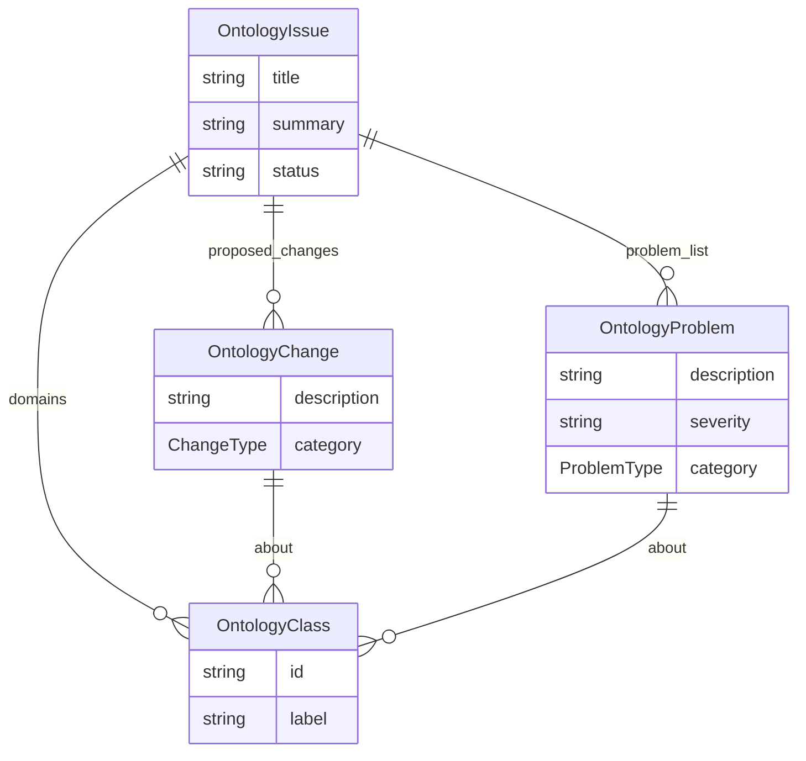

# Ontology Issue Data Model

A data model for representing the contents of a GitHub issue on an ontology tracker

URI: https://w3id.org/ontogpt/ontology_issue
Name: ontology-issue

## Schema Diagram

## Classes

| Class | Description |
| --- | --- |
| [AnnotatorResult](AnnotatorResult.md) |  |
| [Any](Any.md) |  |
| [CompoundExpression](CompoundExpression.md) |  |
| [ExtractionResult](ExtractionResult.md) | A result of extracting knowledge on text |
| [NamedEntity](NamedEntity.md) |  |
| [OntologyChange](OntologyChange.md) |  |
| [OntologyClass](OntologyClass.md) |  |
| [OntologyIssue](OntologyIssue.md) |  |
| [OntologyProblem](OntologyProblem.md) |  |
| [Publication](Publication.md) |  |
| [RelationshipType](RelationshipType.md) |  |
| [TextWithTriples](TextWithTriples.md) |  |
| [Triple](Triple.md) | Abstract parent for Relation Extraction tasks |

## Slots

| Slot | Description |
| --- | --- |
| [about](about.md) | What terms in the ontology is this problem about? |
| [abstract](abstract.md) | The abstract of the publication |
| [category](category.md) | What category does this problem fall into? |
| [combined_text](combined_text.md) |  |
| [description](description.md) | A succinct description of the problem |
| [domains](domains.md) | What part of the ontology does this pertain to |
| [extracted_object](extracted_object.md) | The complex objects extracted from the text |
| [full_text](full_text.md) | The full text of the publication |
| [id](id.md) | A unique identifier for the named entity |
| [input_id](input_id.md) |  |
| [input_text](input_text.md) |  |
| [input_title](input_title.md) |  |
| [label](label.md) | The label (name) of the named thing |
| [named_entities](named_entities.md) | Named entities extracted from the text |
| [object](object.md) |  |
| [object_id](object_id.md) |  |
| [object_qualifier](object_qualifier.md) | An optional qualifier or modifier for the object of the statement, e |
| [object_text](object_text.md) |  |
| [predicate](predicate.md) |  |
| [problem_list](problem_list.md) | A list of problems stated at a high level |
| [prompt](prompt.md) |  |
| [proposed_changes](proposed_changes.md) | What part of the ontology does this pertain to |
| [publication](publication.md) |  |
| [qualifier](qualifier.md) | A qualifier for the statements, e |
| [raw_completion_output](raw_completion_output.md) |  |
| [severity](severity.md) | How severe is this problem? |
| [status](status.md) |  |
| [subject](subject.md) |  |
| [subject_qualifier](subject_qualifier.md) | An optional qualifier or modifier for the subject of the statement, e |
| [subject_text](subject_text.md) |  |
| [summary](summary.md) | a high level summary |
| [title](title.md) | the title of the issue |
| [triples](triples.md) |  |

## Enumerations

| Enumeration | Description |
| --- | --- |
| [ChangeType](ChangeType.md) |  |
| [ProblemType](ProblemType.md) |  |

## Types

| Type | Description |
| --- | --- |
| [Boolean](Boolean.md) | A binary (true or false) value |
| [Date](Date.md) | a date (year, month and day) in an idealized calendar |
| [DateOrDatetime](DateOrDatetime.md) | Either a date or a datetime |
| [Datetime](Datetime.md) | The combination of a date and time |
| [Decimal](Decimal.md) | A real number with arbitrary precision that conforms to the xsd:decimal speci... |
| [Double](Double.md) | A real number that conforms to the xsd:double specification |
| [Float](Float.md) | A real number that conforms to the xsd:float specification |
| [Integer](Integer.md) | An integer |
| [Ncname](Ncname.md) | Prefix part of CURIE |
| [Nodeidentifier](Nodeidentifier.md) | A URI, CURIE or BNODE that represents a node in a model |
| [Objectidentifier](Objectidentifier.md) | A URI or CURIE that represents an object in the model |
| [String](String.md) | A character string |
| [Time](Time.md) | A time object represents a (local) time of day, independent of any particular... |
| [Uri](Uri.md) | a complete URI |
| [Uriorcurie](Uriorcurie.md) | a URI or a CURIE |

## Subsets

| Subset | Description |
| --- | --- |
