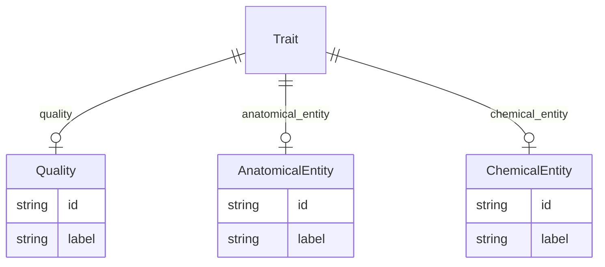

# Class: Trait


URI: [phenotype:Trait](http://w3id.org/ontogpt/phenotype/Trait)





<!-- no inheritance hierarchy -->


## Slots

| Name | Cardinality and Range | Description | Inheritance |
| ---  | --- | --- | --- |
| [quality](quality.md) | 0..1 <br/> [Quality](Quality.md) | The property being measured, or changes in this property, for example, amount... | direct |
| [anatomical_entity](anatomical_entity.md) | 0..1 <br/> [AnatomicalEntity](AnatomicalEntity.md) | The anatomical location that the chemical entity is measured in | direct |
| [chemical_entity](chemical_entity.md) | 0..1 <br/> [ChemicalEntity](ChemicalEntity.md) | The chemical entity that is being measured | direct |


## Identifier and Mapping Information


### Schema Source


* from schema: http://w3id.org/ontogpt/eq


## Mappings

| Mapping Type | Mapped Value |
| ---  | ---  |
| self | phenotype:Trait |
| native | phenotype:Trait |


## LinkML Source

<!-- TODO: investigate https://stackoverflow.com/questions/37606292/how-to-create-tabbed-code-blocks-in-mkdocs-or-sphinx -->

### Direct

<details>
```yaml
name: Trait
from_schema: http://w3id.org/ontogpt/eq
attributes:
  quality:
    name: quality
    annotations:
      prompt.example:
        tag: prompt.example
        value: amount, level, increased amount, decreased concentration
    description: The property being measured, or changes in this property, for example,
      amount, level, increased amount, decreased concentration
    from_schema: http://w3id.org/ontogpt/eq
    rank: 1000
    domain_of:
    - Trait
    range: Quality
  anatomical_entity:
    name: anatomical_entity
    annotations:
      prompt.example:
        tag: prompt.example
        value: liver, heart, brain, finger
    description: The anatomical location that the chemical entity is measured in
    from_schema: http://w3id.org/ontogpt/eq
    rank: 1000
    domain_of:
    - Trait
    range: AnatomicalEntity
  chemical_entity:
    name: chemical_entity
    annotations:
      prompt.example:
        tag: prompt.example
        value: lysine, metabolite
    description: The chemical entity that is being measured
    from_schema: http://w3id.org/ontogpt/eq
    rank: 1000
    domain_of:
    - Trait
    range: ChemicalEntity
tree_root: true

```
</details>

### Induced

<details>
```yaml
name: Trait
from_schema: http://w3id.org/ontogpt/eq
attributes:
  quality:
    name: quality
    annotations:
      prompt.example:
        tag: prompt.example
        value: amount, level, increased amount, decreased concentration
    description: The property being measured, or changes in this property, for example,
      amount, level, increased amount, decreased concentration
    from_schema: http://w3id.org/ontogpt/eq
    rank: 1000
    alias: quality
    owner: Trait
    domain_of:
    - Trait
    range: Quality
  anatomical_entity:
    name: anatomical_entity
    annotations:
      prompt.example:
        tag: prompt.example
        value: liver, heart, brain, finger
    description: The anatomical location that the chemical entity is measured in
    from_schema: http://w3id.org/ontogpt/eq
    rank: 1000
    alias: anatomical_entity
    owner: Trait
    domain_of:
    - Trait
    range: AnatomicalEntity
  chemical_entity:
    name: chemical_entity
    annotations:
      prompt.example:
        tag: prompt.example
        value: lysine, metabolite
    description: The chemical entity that is being measured
    from_schema: http://w3id.org/ontogpt/eq
    rank: 1000
    alias: chemical_entity
    owner: Trait
    domain_of:
    - Trait
    range: ChemicalEntity
tree_root: true

```
</details>