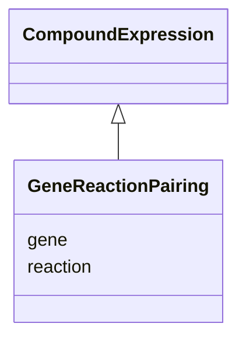

# Class: GeneReactionPairing


URI: [reaction:GeneReactionPairing](http://w3id.org/ontogpt/reaction/GeneReactionPairing)





## Inheritance
* [CompoundExpression](CompoundExpression.md)
    * **GeneReactionPairing**


## Slots

| Name | Cardinality and Range | Description | Inheritance |
| ---  | --- | --- | --- |
| [gene](gene.md) | 0..1 <br/> NONE |  | direct |
| [reaction](reaction.md) | 0..1 <br/> [Reaction](Reaction.md) | equation describing the reaction (e | direct |


## Usages

| used by | used in | type | used |
| ---  | --- | --- | --- |
| [ReactionDocument](ReactionDocument.md) | [gene_reaction_pairings](gene_reaction_pairings.md) | range | [GeneReactionPairing](GeneReactionPairing.md) |


## Identifier and Mapping Information


### Schema Source


* from schema: https://w3id.org/ontogpt/reaction


## Mappings

| Mapping Type | Mapped Value |
| ---  | ---  |
| self | reaction:GeneReactionPairing |
| native | reaction:GeneReactionPairing |


## LinkML Source

<!-- TODO: investigate https://stackoverflow.com/questions/37606292/how-to-create-tabbed-code-blocks-in-mkdocs-or-sphinx -->

### Direct

<details>
```yaml
name: GeneReactionPairing
from_schema: https://w3id.org/ontogpt/reaction
rank: 1000
is_a: CompoundExpression
attributes:
  gene:
    name: gene
    description: name of the gene that catalyzes the reaction
    from_schema: https://w3id.org/ontogpt/reaction
    range: Gene
  reaction:
    name: reaction
    description: equation describing the reaction (e.g. A+B = C+D) catalyzed by the
      gene
    from_schema: https://w3id.org/ontogpt/reaction
    rank: 1000
    range: Reaction

```
</details>

### Induced

<details>
```yaml
name: GeneReactionPairing
from_schema: https://w3id.org/ontogpt/reaction
rank: 1000
is_a: CompoundExpression
attributes:
  gene:
    name: gene
    description: name of the gene that catalyzes the reaction
    from_schema: https://w3id.org/ontogpt/reaction
    alias: gene
    owner: GeneReactionPairing
    domain_of:
    - GeneToReaction
    - GeneReactionPairing
    range: Gene
  reaction:
    name: reaction
    description: equation describing the reaction (e.g. A+B = C+D) catalyzed by the
      gene
    from_schema: https://w3id.org/ontogpt/reaction
    rank: 1000
    alias: reaction
    owner: GeneReactionPairing
    domain_of:
    - GeneReactionPairing
    range: Reaction

```
</details>