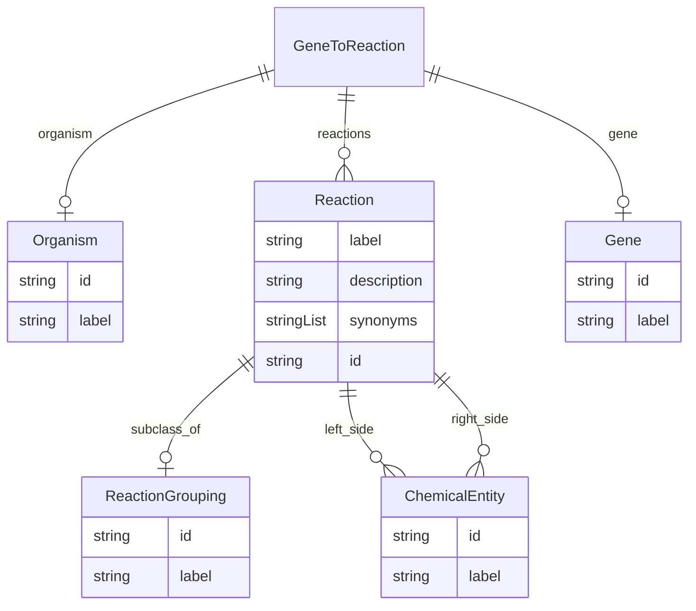

# Class: GeneToReaction


URI: [reaction:GeneToReaction](http://w3id.org/ontogpt/reaction/GeneToReaction)





<!-- no inheritance hierarchy -->


## Slots

| Name | Cardinality and Range | Description | Inheritance |
| ---  | --- | --- | --- |
| [gene](gene.md) | 0..1 <br/> [String](String.md) |  | direct |
| [reactions](reactions.md) | 0..1 <br/> [String](String.md) |  | direct |
| [organism](organism.md) | 0..1 <br/> [String](String.md) |  | direct |


## Identifier and Mapping Information


### Schema Source


* from schema: https://w3id.org/ontogpt/reaction


## Mappings

| Mapping Type | Mapped Value |
| ---  | ---  |
| self | reaction:GeneToReaction |
| native | reaction:GeneToReaction |


## LinkML Source

<!-- TODO: investigate https://stackoverflow.com/questions/37606292/how-to-create-tabbed-code-blocks-in-mkdocs-or-sphinx -->

### Direct

<details>
```yaml
name: GeneToReaction
from_schema: https://w3id.org/ontogpt/reaction
rank: 1000
attributes:
  gene:
    name: gene
    description: name of the gene that catalyzes the reaction
    from_schema: https://w3id.org/ontogpt/reaction
    rank: 1000
    range: Gene
  reactions:
    name: reactions
    description: semicolon separated list of reaction equations (e.g. A+B = C+D) catalyzed
      by the gene
    from_schema: https://w3id.org/ontogpt/reaction
    rank: 1000
    multivalued: true
    range: Reaction
    inlined: true
  organism:
    name: organism
    from_schema: https://w3id.org/ontogpt/reaction
    rank: 1000
    range: Organism

```
</details>

### Induced

<details>
```yaml
name: GeneToReaction
from_schema: https://w3id.org/ontogpt/reaction
rank: 1000
attributes:
  gene:
    name: gene
    description: name of the gene that catalyzes the reaction
    from_schema: https://w3id.org/ontogpt/reaction
    rank: 1000
    alias: gene
    owner: GeneToReaction
    domain_of:
    - GeneToReaction
    - GeneReactionPairing
    range: Gene
  reactions:
    name: reactions
    description: semicolon separated list of reaction equations (e.g. A+B = C+D) catalyzed
      by the gene
    from_schema: https://w3id.org/ontogpt/reaction
    rank: 1000
    multivalued: true
    alias: reactions
    owner: GeneToReaction
    domain_of:
    - GeneToReaction
    - ReactionDocument
    range: Reaction
    inlined: true
  organism:
    name: organism
    from_schema: https://w3id.org/ontogpt/reaction
    rank: 1000
    alias: organism
    owner: GeneToReaction
    domain_of:
    - GeneToReaction
    - ReactionDocument
    range: Organism

```
</details>