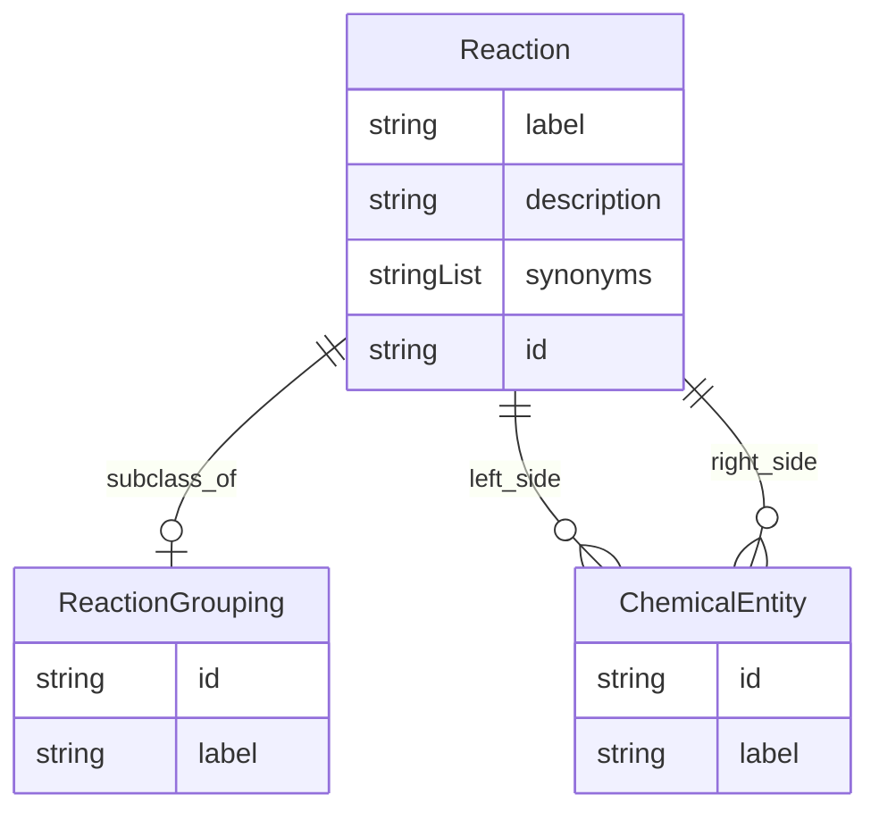

# Class: Reaction


URI: [reaction:Reaction](http://w3id.org/ontogpt/reaction/Reaction)





## Inheritance
* [NamedEntity](NamedEntity.md)
    * **Reaction**


## Slots

| Name | Cardinality and Range | Description | Inheritance |
| ---  | --- | --- | --- |
| [label](label.md) | 0..1 <br/> [String](String.md) |  | direct |
| [description](description.md) | 0..1 <br/> [String](String.md) | a textual description of the reaction | direct |
| [synonyms](synonyms.md) | 0..* <br/> [String](String.md) | alternative names of the reaction | direct |
| [subclass_of](subclass_of.md) | 0..1 <br/> [ReactionGrouping](ReactionGrouping.md) | the category to which this biological process belongs | direct |
| [left_side](left_side.md) | 0..* <br/> [ChemicalEntity](ChemicalEntity.md) | semicolon separated list of chemical entities on the left side | direct |
| [right_side](right_side.md) | 0..* <br/> [ChemicalEntity](ChemicalEntity.md) | semicolon separated list of chemical entities on the right side | direct |
| [id](id.md) | 1..1 <br/> [String](String.md) | A unique identifier for the named entity | [NamedEntity](NamedEntity.md) |


## Usages

| used by | used in | type | used |
| ---  | --- | --- | --- |
| [GeneToReaction](GeneToReaction.md) | [reactions](reactions.md) | range | [Reaction](Reaction.md) |
| [ReactionDocument](ReactionDocument.md) | [reactions](reactions.md) | range | [Reaction](Reaction.md) |
| [GeneReactionPairing](GeneReactionPairing.md) | [reaction](reaction.md) | range | [Reaction](Reaction.md) |


## Identifier and Mapping Information


### Schema Source


* from schema: https://w3id.org/ontogpt/reaction


## Mappings

| Mapping Type | Mapped Value |
| ---  | ---  |
| self | reaction:Reaction |
| native | reaction:Reaction |


## LinkML Source

<!-- TODO: investigate https://stackoverflow.com/questions/37606292/how-to-create-tabbed-code-blocks-in-mkdocs-or-sphinx -->

### Direct

<details>
```yaml
name: Reaction
from_schema: https://w3id.org/ontogpt/reaction
rank: 1000
is_a: NamedEntity
attributes:
  label:
    name: label
    description: the name of the reaction
    from_schema: https://w3id.org/ontogpt/reaction
    rank: 1000
  description:
    name: description
    description: a textual description of the reaction
    from_schema: https://w3id.org/ontogpt/reaction
    rank: 1000
  synonyms:
    name: synonyms
    description: alternative names of the reaction
    from_schema: https://w3id.org/ontogpt/reaction
    rank: 1000
    multivalued: true
  subclass_of:
    name: subclass_of
    description: the category to which this biological process belongs
    from_schema: https://w3id.org/ontogpt/reaction
    rank: 1000
    range: ReactionGrouping
  left_side:
    name: left_side
    description: semicolon separated list of chemical entities on the left side
    from_schema: https://w3id.org/ontogpt/reaction
    rank: 1000
    multivalued: true
    range: ChemicalEntity
  right_side:
    name: right_side
    description: semicolon separated list of chemical entities on the right side
    from_schema: https://w3id.org/ontogpt/reaction
    rank: 1000
    multivalued: true
    range: ChemicalEntity

```
</details>

### Induced

<details>
```yaml
name: Reaction
from_schema: https://w3id.org/ontogpt/reaction
rank: 1000
is_a: NamedEntity
attributes:
  label:
    name: label
    description: the name of the reaction
    from_schema: https://w3id.org/ontogpt/reaction
    rank: 1000
    alias: label
    owner: Reaction
    domain_of:
    - Reaction
    - NamedEntity
    range: string
  description:
    name: description
    description: a textual description of the reaction
    from_schema: https://w3id.org/ontogpt/reaction
    rank: 1000
    alias: description
    owner: Reaction
    domain_of:
    - Reaction
    range: string
  synonyms:
    name: synonyms
    description: alternative names of the reaction
    from_schema: https://w3id.org/ontogpt/reaction
    rank: 1000
    multivalued: true
    alias: synonyms
    owner: Reaction
    domain_of:
    - Reaction
    range: string
  subclass_of:
    name: subclass_of
    description: the category to which this biological process belongs
    from_schema: https://w3id.org/ontogpt/reaction
    rank: 1000
    alias: subclass_of
    owner: Reaction
    domain_of:
    - Reaction
    range: ReactionGrouping
  left_side:
    name: left_side
    description: semicolon separated list of chemical entities on the left side
    from_schema: https://w3id.org/ontogpt/reaction
    rank: 1000
    multivalued: true
    alias: left_side
    owner: Reaction
    domain_of:
    - Reaction
    range: ChemicalEntity
  right_side:
    name: right_side
    description: semicolon separated list of chemical entities on the right side
    from_schema: https://w3id.org/ontogpt/reaction
    rank: 1000
    multivalued: true
    alias: right_side
    owner: Reaction
    domain_of:
    - Reaction
    range: ChemicalEntity
  id:
    name: id
    annotations:
      prompt.skip:
        tag: prompt.skip
        value: 'true'
    description: A unique identifier for the named entity
    comments:
    - this is populated during the grounding and normalization step
    from_schema: https://w3id.org/ontogpt/reaction
    rank: 1000
    identifier: true
    alias: id
    owner: Reaction
    domain_of:
    - NamedEntity
    - Publication
    range: string

```
</details>