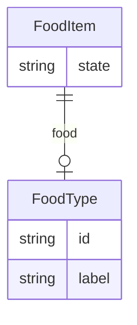

# Class: FoodItem


URI: [recipe:FoodItem](http://w3id.org/ontogpt/recipe/FoodItem)





## Inheritance
* [CompoundExpression](CompoundExpression.md)
    * **FoodItem**


## Slots

| Name | Cardinality and Range | Description | Inheritance |
| ---  | --- | --- | --- |
| [food](food.md) | 0..1 <br/> [FoodType](FoodType.md) | the food item | direct |
| [state](state.md) | 0..1 <br/> [String](String.md) | the state of the food item (e | direct |


## Usages

| used by | used in | type | used |
| ---  | --- | --- | --- |
| [Ingredient](Ingredient.md) | [food_item](food_item.md) | range | [FoodItem](FoodItem.md) |
| [Step](Step.md) | [inputs](inputs.md) | range | [FoodItem](FoodItem.md) |
| [Step](Step.md) | [outputs](outputs.md) | range | [FoodItem](FoodItem.md) |


## Identifier and Mapping Information


### Annotations

| property | value |
| --- | --- |
| owl | IntersectionOf |


### Schema Source


* from schema: https://w3id.org/ontogpt/recipe


## Mappings

| Mapping Type | Mapped Value |
| ---  | ---  |
| self | recipe:FoodItem |
| native | recipe:FoodItem |


## LinkML Source

<!-- TODO: investigate https://stackoverflow.com/questions/37606292/how-to-create-tabbed-code-blocks-in-mkdocs-or-sphinx -->

### Direct

<details>
```yaml
name: FoodItem
annotations:
  owl:
    tag: owl
    value: IntersectionOf
from_schema: https://w3id.org/ontogpt/recipe
is_a: CompoundExpression
attributes:
  food:
    name: food
    annotations:
      owl:
        tag: owl
        value: ObjectProperty, ObjectSomeValuesFrom
    description: the food item
    from_schema: https://w3id.org/ontogpt/recipe
    rank: 1000
    slot_uri: BFO:0000051
    domain_of:
    - FoodItem
    range: FoodType
  state:
    name: state
    annotations:
      owl:
        tag: owl
        value: DataProperty, DataHasValue
    description: the state of the food item (e.g. chopped, diced)
    from_schema: https://w3id.org/ontogpt/recipe
    rank: 1000
    domain_of:
    - FoodItem

```
</details>

### Induced

<details>
```yaml
name: FoodItem
annotations:
  owl:
    tag: owl
    value: IntersectionOf
from_schema: https://w3id.org/ontogpt/recipe
is_a: CompoundExpression
attributes:
  food:
    name: food
    annotations:
      owl:
        tag: owl
        value: ObjectProperty, ObjectSomeValuesFrom
    description: the food item
    from_schema: https://w3id.org/ontogpt/recipe
    rank: 1000
    slot_uri: BFO:0000051
    alias: food
    owner: FoodItem
    domain_of:
    - FoodItem
    range: FoodType
  state:
    name: state
    annotations:
      owl:
        tag: owl
        value: DataProperty, DataHasValue
    description: the state of the food item (e.g. chopped, diced)
    from_schema: https://w3id.org/ontogpt/recipe
    rank: 1000
    alias: state
    owner: FoodItem
    domain_of:
    - FoodItem
    range: string

```
</details>