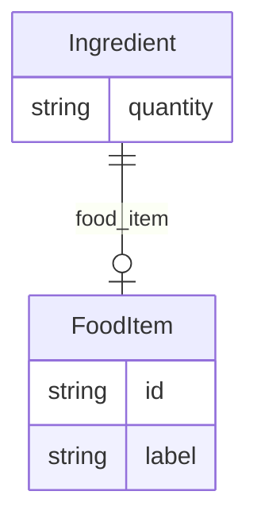

# Class: Ingredient


URI: [recipe:Ingredient](http://w3id.org/ontogpt/recipe/Ingredient)





## Inheritance
* [CompoundExpression](CompoundExpression.md)
    * **Ingredient**


## Slots

| Name | Cardinality and Range | Description | Inheritance |
| ---  | --- | --- | --- |
| [food_item](food_item.md) | 0..1 <br/> [FoodItem](FoodItem.md) | the food item | direct |
| [quantity](quantity.md) | 0..1 <br/> [xsd:string](xsd:string) | the quantity of the ingredient | direct |


## Usages

| used by | used in | type | used |
| ---  | --- | --- | --- |
| [Recipe](Recipe.md) | [ingredients](ingredients.md) | range | [Ingredient](Ingredient.md) |


## Identifier and Mapping Information


### Schema Source


* from schema: https://w3id.org/ontogpt/recipe


## Mappings

| Mapping Type | Mapped Value |
| ---  | ---  |
| self | recipe:Ingredient |
| native | recipe:Ingredient |


## LinkML Source

<!-- TODO: investigate https://stackoverflow.com/questions/37606292/how-to-create-tabbed-code-blocks-in-mkdocs-or-sphinx -->

### Direct

<details>
```yaml
name: Ingredient
from_schema: https://w3id.org/ontogpt/recipe
rank: 1000
is_a: CompoundExpression
attributes:
  food_item:
    name: food_item
    description: the food item
    from_schema: https://w3id.org/ontogpt/recipe
    rank: 1000
    range: FoodItem
  quantity:
    name: quantity
    description: the quantity of the ingredient
    from_schema: https://w3id.org/ontogpt/recipe
    rank: 1000
    range: string

```
</details>

### Induced

<details>
```yaml
name: Ingredient
from_schema: https://w3id.org/ontogpt/recipe
rank: 1000
is_a: CompoundExpression
attributes:
  food_item:
    name: food_item
    description: the food item
    from_schema: https://w3id.org/ontogpt/recipe
    rank: 1000
    alias: food_item
    owner: Ingredient
    domain_of:
    - Ingredient
    range: FoodItem
  quantity:
    name: quantity
    description: the quantity of the ingredient
    from_schema: https://w3id.org/ontogpt/recipe
    rank: 1000
    alias: quantity
    owner: Ingredient
    domain_of:
    - Ingredient
    range: string

```
</details>