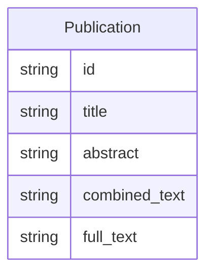

# Class: Publication


URI: [recipe:Publication](http://w3id.org/ontogpt/recipe/Publication)





<!-- no inheritance hierarchy -->


## Slots

| Name | Cardinality and Range | Description | Inheritance |
| ---  | --- | --- | --- |
| [id](id.md) | 0..1 <br/> [String](String.md) |  | direct |
| [title](title.md) | 0..1 <br/> [String](String.md) | The title of the publication | direct |
| [abstract](abstract.md) | 0..1 <br/> [String](String.md) | The abstract of the publication | direct |
| [combined_text](combined_text.md) | 0..1 <br/> [String](String.md) |  | direct |
| [full_text](full_text.md) | 0..1 <br/> [String](String.md) | The full text of the publication | direct |


## Usages

| used by | used in | type | used |
| ---  | --- | --- | --- |
| [TextWithTriples](TextWithTriples.md) | [publication](publication.md) | range | [Publication](Publication.md) |


## Identifier and Mapping Information


### Schema Source


* from schema: https://w3id.org/ontogpt/recipe


## Mappings

| Mapping Type | Mapped Value |
| ---  | ---  |
| self | recipe:Publication |
| native | recipe:Publication |


## LinkML Source

<!-- TODO: investigate https://stackoverflow.com/questions/37606292/how-to-create-tabbed-code-blocks-in-mkdocs-or-sphinx -->

### Direct

<details>
```yaml
name: Publication
from_schema: https://w3id.org/ontogpt/recipe
rank: 1000
attributes:
  id:
    name: id
    description: The publication identifier
    from_schema: https://w3id.org/ontogpt/recipe
  title:
    name: title
    description: The title of the publication
    from_schema: https://w3id.org/ontogpt/recipe
    rank: 1000
  abstract:
    name: abstract
    description: The abstract of the publication
    from_schema: https://w3id.org/ontogpt/recipe
    rank: 1000
  combined_text:
    name: combined_text
    from_schema: https://w3id.org/ontogpt/recipe
    rank: 1000
  full_text:
    name: full_text
    description: The full text of the publication
    from_schema: https://w3id.org/ontogpt/recipe
    rank: 1000

```
</details>

### Induced

<details>
```yaml
name: Publication
from_schema: https://w3id.org/ontogpt/recipe
rank: 1000
attributes:
  id:
    name: id
    description: The publication identifier
    from_schema: https://w3id.org/ontogpt/recipe
    alias: id
    owner: Publication
    domain_of:
    - NamedEntity
    - Publication
    range: string
  title:
    name: title
    description: The title of the publication
    from_schema: https://w3id.org/ontogpt/recipe
    rank: 1000
    alias: title
    owner: Publication
    domain_of:
    - Publication
    range: string
  abstract:
    name: abstract
    description: The abstract of the publication
    from_schema: https://w3id.org/ontogpt/recipe
    rank: 1000
    alias: abstract
    owner: Publication
    domain_of:
    - Publication
    range: string
  combined_text:
    name: combined_text
    from_schema: https://w3id.org/ontogpt/recipe
    rank: 1000
    alias: combined_text
    owner: Publication
    domain_of:
    - Publication
    range: string
  full_text:
    name: full_text
    description: The full text of the publication
    from_schema: https://w3id.org/ontogpt/recipe
    rank: 1000
    alias: full_text
    owner: Publication
    domain_of:
    - Publication
    range: string

```
</details>