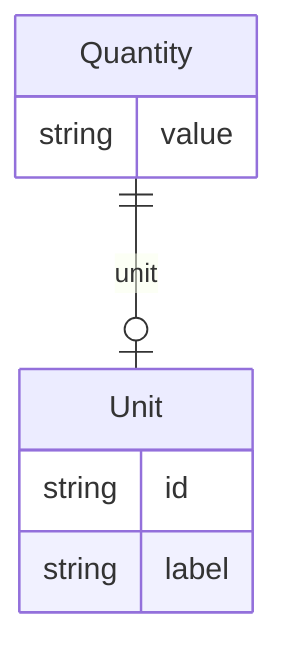

# Class: Quantity


URI: [recipe:Quantity](http://w3id.org/ontogpt/recipe/Quantity)





## Inheritance
* [CompoundExpression](CompoundExpression.md)
    * **Quantity**


## Slots

| Name | Cardinality and Range | Description | Inheritance |
| ---  | --- | --- | --- |
| [value](value.md) | 0..1 <br/> [String](String.md) | the value of the quantity | direct |
| [unit](unit.md) | 0..1 <br/> [Unit](Unit.md) | the unit of the quantity, e | direct |


## Usages

| used by | used in | type | used |
| ---  | --- | --- | --- |
| [Ingredient](Ingredient.md) | [amount](amount.md) | range | [Quantity](Quantity.md) |


## Identifier and Mapping Information


### Annotations

| property | value |
| --- | --- |
| owl | IntersectionOf |


### Schema Source


* from schema: https://w3id.org/ontogpt/recipe


## Mappings

| Mapping Type | Mapped Value |
| ---  | ---  |
| self | recipe:Quantity |
| native | recipe:Quantity |


## LinkML Source

<!-- TODO: investigate https://stackoverflow.com/questions/37606292/how-to-create-tabbed-code-blocks-in-mkdocs-or-sphinx -->

### Direct

<details>
```yaml
name: Quantity
annotations:
  owl:
    tag: owl
    value: IntersectionOf
from_schema: https://w3id.org/ontogpt/recipe
rank: 1000
is_a: CompoundExpression
attributes:
  value:
    name: value
    annotations:
      owl:
        tag: owl
        value: DataProperty, DataHasValue
    description: the value of the quantity
    from_schema: https://w3id.org/ontogpt/recipe
    rank: 1000
  unit:
    name: unit
    annotations:
      owl:
        tag: owl
        value: ObjectProperty, ObjectSomeValuesFrom
    description: the unit of the quantity, e.g. grams, cups, etc.
    from_schema: https://w3id.org/ontogpt/recipe
    rank: 1000
    slot_uri: qudt:unit
    range: Unit

```
</details>

### Induced

<details>
```yaml
name: Quantity
annotations:
  owl:
    tag: owl
    value: IntersectionOf
from_schema: https://w3id.org/ontogpt/recipe
rank: 1000
is_a: CompoundExpression
attributes:
  value:
    name: value
    annotations:
      owl:
        tag: owl
        value: DataProperty, DataHasValue
    description: the value of the quantity
    from_schema: https://w3id.org/ontogpt/recipe
    rank: 1000
    alias: value
    owner: Quantity
    domain_of:
    - Quantity
    range: string
  unit:
    name: unit
    annotations:
      owl:
        tag: owl
        value: ObjectProperty, ObjectSomeValuesFrom
    description: the unit of the quantity, e.g. grams, cups, etc.
    from_schema: https://w3id.org/ontogpt/recipe
    rank: 1000
    slot_uri: qudt:unit
    alias: unit
    owner: Quantity
    domain_of:
    - Quantity
    range: Unit

```
</details>