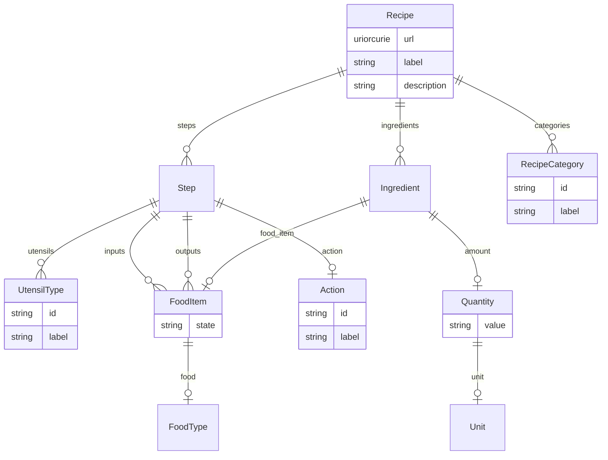

# Class: Recipe


URI: [recipe:Recipe](http://w3id.org/ontogpt/recipe/Recipe)





<!-- no inheritance hierarchy -->


## Slots

| Name | Cardinality and Range | Description | Inheritance |
| ---  | --- | --- | --- |
| [url](url.md) | 1..1 <br/> [Uriorcurie](Uriorcurie.md) |  | direct |
| [label](label.md) | 0..1 <br/> [String](String.md) |  | direct |
| [description](description.md) | 0..1 <br/> [String](String.md) | a brief textual description of the recipe | direct |
| [categories](categories.md) | 0..* <br/> [RecipeCategory](RecipeCategory.md) | a semicolon separated list of the categories to which this recipe belongs | direct |
| [ingredients](ingredients.md) | 0..* <br/> [Ingredient](Ingredient.md) | a semicolon separated list of the ingredients plus quantities of the recipe | direct |
| [steps](steps.md) | 0..* <br/> [Step](Step.md) | a semicolon separated list of the individual steps involved in this recipe | direct |


## Identifier and Mapping Information


### Annotations

| property | value |
| --- | --- |
| owl | Class || owl.template | EquivalentClasses(
  {{url}}
  ObjectIntersectionOf(
    recipe:Recipe
    
    
    ObjectSomeValuesFrom(
      recipe:steps
      {{tr(step)}}
    )
    
    
    ObjectSomeValuesFrom(
      FOODON:00002420
      {{tr(ingredient)}}
    )
    
  )
)
 |


### Schema Source


* from schema: https://w3id.org/ontogpt/recipe


## Mappings

| Mapping Type | Mapped Value |
| ---  | ---  |
| self | recipe:Recipe |
| native | recipe:Recipe |
| close | FOODON:00004081 |


## LinkML Source

<!-- TODO: investigate https://stackoverflow.com/questions/37606292/how-to-create-tabbed-code-blocks-in-mkdocs-or-sphinx -->

### Direct

<details>
```yaml
name: Recipe
annotations:
  owl:
    tag: owl
    value: Class
  owl.template:
    tag: owl.template
    value: "EquivalentClasses(\n  {{url}}\n  ObjectIntersectionOf(\n    recipe:Recipe\n\
      \    \n    \n    ObjectSomeValuesFrom(\n      recipe:steps\n\
      \      {{tr(step)}}\n    )\n    \n    \n    ObjectSomeValuesFrom(\n      FOODON:00002420\n      {{tr(ingredient)}}\n\
      \    )\n    \n  )\n)\n"
from_schema: https://w3id.org/ontogpt/recipe
close_mappings:
- FOODON:00004081
rank: 1000
attributes:
  url:
    name: url
    annotations:
      prompt.ignore:
        tag: prompt.ignore
        value: 'True'
    from_schema: https://w3id.org/ontogpt/recipe
    rank: 1000
    slot_uri: rdf:Resource
    identifier: true
    range: uriorcurie
  label:
    name: label
    annotations:
      owl:
        tag: owl
        value: AnnotationProperty, AnnotationAssertion
    description: the name of the recipe
    from_schema: https://w3id.org/ontogpt/recipe
    rank: 1000
    slot_uri: rdfs:label
  description:
    name: description
    annotations:
      owl:
        tag: owl
        value: AnnotationProperty, AnnotationAssertion
    description: a brief textual description of the recipe
    from_schema: https://w3id.org/ontogpt/recipe
    rank: 1000
    slot_uri: dcterms:description
  categories:
    name: categories
    annotations:
      owl:
        tag: owl
        value: AnnotationAssertion
    description: a semicolon separated list of the categories to which this recipe
      belongs
    from_schema: https://w3id.org/ontogpt/recipe
    rank: 1000
    slot_uri: dcterms:subject
    multivalued: true
    range: RecipeCategory
  ingredients:
    name: ingredients
    annotations:
      owl:
        tag: owl
        value: ObjectProperty, ObjectSomeValuesFrom
    description: a semicolon separated list of the ingredients plus quantities of
      the recipe
    from_schema: https://w3id.org/ontogpt/recipe
    rank: 1000
    slot_uri: FOODON:00002420
    multivalued: true
    range: Ingredient
  steps:
    name: steps
    annotations:
      owl:
        tag: owl
        value: ObjectProperty, ObjectSomeValuesFrom
    description: a semicolon separated list of the individual steps involved in this
      recipe
    from_schema: https://w3id.org/ontogpt/recipe
    rank: 1000
    multivalued: true
    range: Step
tree_root: true

```
</details>

### Induced

<details>
```yaml
name: Recipe
annotations:
  owl:
    tag: owl
    value: Class
  owl.template:
    tag: owl.template
    value: "EquivalentClasses(\n  {{url}}\n  ObjectIntersectionOf(\n    recipe:Recipe\n\
      \    \n    \n    ObjectSomeValuesFrom(\n      recipe:steps\n\
      \      {{tr(step)}}\n    )\n    \n    \n    ObjectSomeValuesFrom(\n      FOODON:00002420\n      {{tr(ingredient)}}\n\
      \    )\n    \n  )\n)\n"
from_schema: https://w3id.org/ontogpt/recipe
close_mappings:
- FOODON:00004081
rank: 1000
attributes:
  url:
    name: url
    annotations:
      prompt.ignore:
        tag: prompt.ignore
        value: 'True'
    from_schema: https://w3id.org/ontogpt/recipe
    rank: 1000
    slot_uri: rdf:Resource
    identifier: true
    alias: url
    owner: Recipe
    domain_of:
    - Recipe
    range: uriorcurie
  label:
    name: label
    annotations:
      owl:
        tag: owl
        value: AnnotationProperty, AnnotationAssertion
    description: the name of the recipe
    from_schema: https://w3id.org/ontogpt/recipe
    rank: 1000
    slot_uri: rdfs:label
    alias: label
    owner: Recipe
    domain_of:
    - Recipe
    - NamedEntity
    range: string
  description:
    name: description
    annotations:
      owl:
        tag: owl
        value: AnnotationProperty, AnnotationAssertion
    description: a brief textual description of the recipe
    from_schema: https://w3id.org/ontogpt/recipe
    rank: 1000
    slot_uri: dcterms:description
    alias: description
    owner: Recipe
    domain_of:
    - Recipe
    range: string
  categories:
    name: categories
    annotations:
      owl:
        tag: owl
        value: AnnotationAssertion
    description: a semicolon separated list of the categories to which this recipe
      belongs
    from_schema: https://w3id.org/ontogpt/recipe
    rank: 1000
    slot_uri: dcterms:subject
    multivalued: true
    alias: categories
    owner: Recipe
    domain_of:
    - Recipe
    range: RecipeCategory
  ingredients:
    name: ingredients
    annotations:
      owl:
        tag: owl
        value: ObjectProperty, ObjectSomeValuesFrom
    description: a semicolon separated list of the ingredients plus quantities of
      the recipe
    from_schema: https://w3id.org/ontogpt/recipe
    rank: 1000
    slot_uri: FOODON:00002420
    multivalued: true
    alias: ingredients
    owner: Recipe
    domain_of:
    - Recipe
    range: Ingredient
  steps:
    name: steps
    annotations:
      owl:
        tag: owl
        value: ObjectProperty, ObjectSomeValuesFrom
    description: a semicolon separated list of the individual steps involved in this
      recipe
    from_schema: https://w3id.org/ontogpt/recipe
    rank: 1000
    multivalued: true
    alias: steps
    owner: Recipe
    domain_of:
    - Recipe
    range: Step
tree_root: true

```
</details>