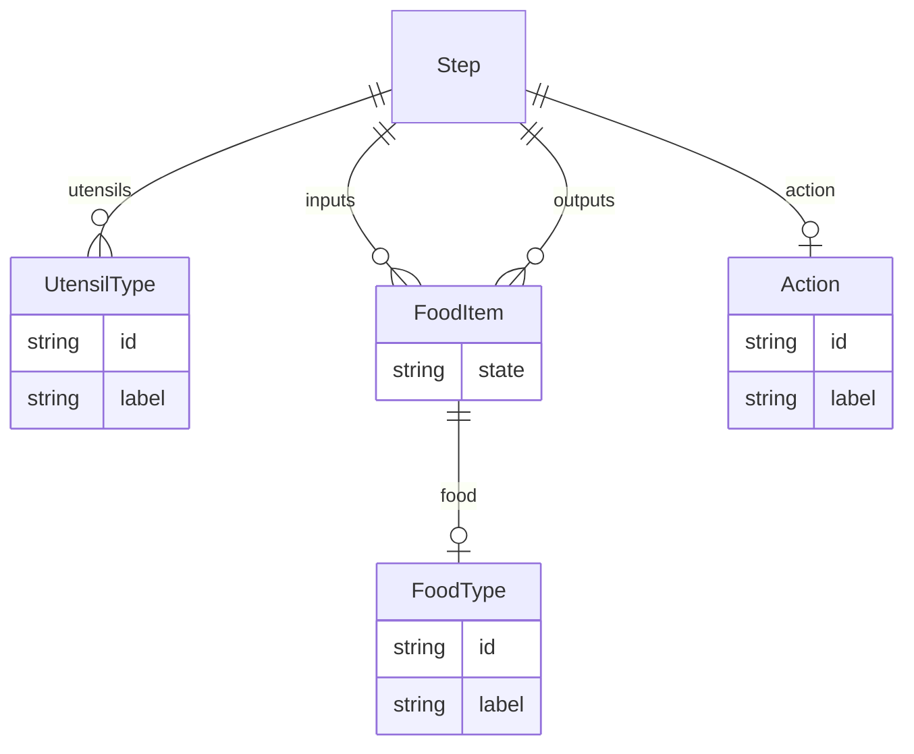

# Class: Step


URI: [FOODON:00004087](http://purl.obolibrary.org/obo/FOODON_00004087)





## Inheritance
* [CompoundExpression](CompoundExpression.md)
    * **Step**


## Slots

| Name | Cardinality and Range | Description | Inheritance |
| ---  | --- | --- | --- |
| [action](action.md) | 0..1 <br/> [Action](Action.md) | the action taken in this step (e | direct |
| [inputs](inputs.md) | * <br/> [FoodItem](FoodItem.md) | a semicolon separated list of the inputs of this step | direct |
| [outputs](outputs.md) | * <br/> [FoodItem](FoodItem.md) | a semicolon separated list of the outputs of this step | direct |
| [utensils](utensils.md) | * <br/> [UtensilType](UtensilType.md) | the kitchen utensil used in this step (e | direct |


## Usages

| used by | used in | type | used |
| ---  | --- | --- | --- |
| [Recipe](Recipe.md) | [steps](steps.md) | range | [Step](Step.md) |


## Identifier and Mapping Information


### Annotations

| property | value |
| --- | --- |
| owl | IntersectionOf |


### Schema Source


* from schema: https://w3id.org/ontogpt/recipe


## Mappings

| Mapping Type | Mapped Value |
| ---  | ---  |
| self | FOODON:00004087 |
| native | recipe:Step |


## LinkML Source

<!-- TODO: investigate https://stackoverflow.com/questions/37606292/how-to-create-tabbed-code-blocks-in-mkdocs-or-sphinx -->

### Direct

<details>
```yaml
name: Step
annotations:
  owl:
    tag: owl
    value: IntersectionOf
from_schema: https://w3id.org/ontogpt/recipe
is_a: CompoundExpression
attributes:
  action:
    name: action
    description: the action taken in this step (e.g. mix, add)
    from_schema: https://w3id.org/ontogpt/recipe
    rank: 1000
    domain_of:
    - Step
    range: Action
  inputs:
    name: inputs
    annotations:
      owl:
        tag: owl
        value: ObjectProperty, ObjectSomeValuesFrom
    description: a semicolon separated list of the inputs of this step
    from_schema: https://w3id.org/ontogpt/recipe
    rank: 1000
    slot_uri: RO:0002233
    multivalued: true
    domain_of:
    - Step
    range: FoodItem
  outputs:
    name: outputs
    annotations:
      owl:
        tag: owl
        value: ObjectProperty, ObjectSomeValuesFrom
    description: a semicolon separated list of the outputs of this step
    from_schema: https://w3id.org/ontogpt/recipe
    rank: 1000
    slot_uri: RO:0002234
    multivalued: true
    domain_of:
    - Step
    range: FoodItem
  utensils:
    name: utensils
    annotations:
      owl:
        tag: owl
        value: ObjectProperty, ObjectSomeValuesFrom
    description: the kitchen utensil used in this step (e.g. pan, bowl)
    from_schema: https://w3id.org/ontogpt/recipe
    rank: 1000
    slot_uri: RO:0002500
    multivalued: true
    domain_of:
    - Step
    range: UtensilType
class_uri: FOODON:00004087

```
</details>

### Induced

<details>
```yaml
name: Step
annotations:
  owl:
    tag: owl
    value: IntersectionOf
from_schema: https://w3id.org/ontogpt/recipe
is_a: CompoundExpression
attributes:
  action:
    name: action
    description: the action taken in this step (e.g. mix, add)
    from_schema: https://w3id.org/ontogpt/recipe
    rank: 1000
    alias: action
    owner: Step
    domain_of:
    - Step
    range: Action
  inputs:
    name: inputs
    annotations:
      owl:
        tag: owl
        value: ObjectProperty, ObjectSomeValuesFrom
    description: a semicolon separated list of the inputs of this step
    from_schema: https://w3id.org/ontogpt/recipe
    rank: 1000
    slot_uri: RO:0002233
    multivalued: true
    alias: inputs
    owner: Step
    domain_of:
    - Step
    range: FoodItem
  outputs:
    name: outputs
    annotations:
      owl:
        tag: owl
        value: ObjectProperty, ObjectSomeValuesFrom
    description: a semicolon separated list of the outputs of this step
    from_schema: https://w3id.org/ontogpt/recipe
    rank: 1000
    slot_uri: RO:0002234
    multivalued: true
    alias: outputs
    owner: Step
    domain_of:
    - Step
    range: FoodItem
  utensils:
    name: utensils
    annotations:
      owl:
        tag: owl
        value: ObjectProperty, ObjectSomeValuesFrom
    description: the kitchen utensil used in this step (e.g. pan, bowl)
    from_schema: https://w3id.org/ontogpt/recipe
    rank: 1000
    slot_uri: RO:0002500
    multivalued: true
    alias: utensils
    owner: Step
    domain_of:
    - Step
    range: UtensilType
class_uri: FOODON:00004087

```
</details>