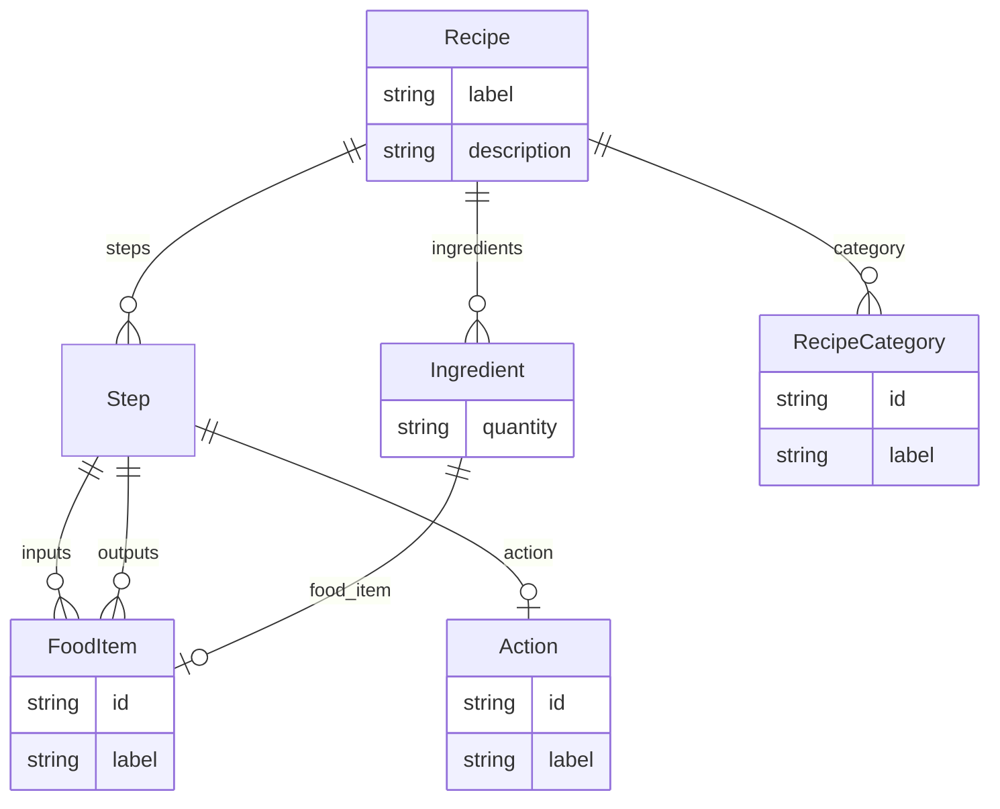

# Food Recipe Template

A template for food recipes

URI: https://w3id.org/ontogpt/recipe
Name: recipe-template

## Schema Diagram

## Classes

| Class | Description |
| --- | --- |
| [Action](Action.md) |  |
| [AnnotatorResult](AnnotatorResult.md) |  |
| [Any](Any.md) |  |
| [CompoundExpression](CompoundExpression.md) |  |
| [ExtractionResult](ExtractionResult.md) | A result of extracting knowledge on text |
| [FoodItem](FoodItem.md) |  |
| [Ingredient](Ingredient.md) |  |
| [NamedEntity](NamedEntity.md) |  |
| [Publication](Publication.md) |  |
| [Recipe](Recipe.md) |  |
| [RecipeCategory](RecipeCategory.md) |  |
| [RelationshipType](RelationshipType.md) |  |
| [Step](Step.md) |  |
| [TextWithTriples](TextWithTriples.md) |  |
| [Triple](Triple.md) | Abstract parent for Relation Extraction tasks |

## Slots

| Slot | Description |
| --- | --- |
| [abstract](abstract.md) | The abstract of the publication |
| [action](action.md) | the action taken in this step (e |
| [category](category.md) | a semicolon separated list of the categories to which this recipe belongs |
| [combined_text](combined_text.md) |  |
| [description](description.md) | a brief textual description of the recipe |
| [extracted_object](extracted_object.md) | The complex objects extracted from the text |
| [food_item](food_item.md) | the food item |
| [full_text](full_text.md) | The full text of the publication |
| [id](id.md) | A unique identifier for the named entity |
| [ingredients](ingredients.md) | a semicolon separated list of the ingredients plus quantities of the recipe |
| [input_id](input_id.md) |  |
| [input_text](input_text.md) |  |
| [input_title](input_title.md) |  |
| [inputs](inputs.md) | a semicolon separated list of the inputs of this step |
| [label](label.md) | the name of the recipe |
| [named_entities](named_entities.md) | Named entities extracted from the text |
| [object](object.md) |  |
| [object_id](object_id.md) |  |
| [object_qualifier](object_qualifier.md) | An optional qualifier or modifier for the object of the statement, e |
| [object_text](object_text.md) |  |
| [outputs](outputs.md) | a semicolon separated list of the outputs of this step |
| [predicate](predicate.md) |  |
| [prompt](prompt.md) |  |
| [publication](publication.md) |  |
| [qualifier](qualifier.md) | A qualifier for the statements, e |
| [quantity](quantity.md) | the quantity of the ingredient |
| [raw_completion_output](raw_completion_output.md) |  |
| [steps](steps.md) | a semicolon separated list of the individual steps involved in this recipe |
| [subject](subject.md) |  |
| [subject_qualifier](subject_qualifier.md) | An optional qualifier or modifier for the subject of the statement, e |
| [subject_text](subject_text.md) |  |
| [title](title.md) | The title of the publication |
| [triples](triples.md) |  |

## Enumerations

| Enumeration | Description |
| --- | --- |

## Types

| Type | Description |
| --- | --- |
| [xsd:boolean](xsd:boolean) | A binary (true or false) value |
| [xsd:date](xsd:date) | a date (year, month and day) in an idealized calendar |
| [linkml:DateOrDatetime](https://w3id.org/linkml/DateOrDatetime) | Either a date or a datetime |
| [xsd:dateTime](xsd:dateTime) | The combination of a date and time |
| [xsd:decimal](xsd:decimal) | A real number with arbitrary precision that conforms to the xsd:decimal speci... |
| [xsd:double](xsd:double) | A real number that conforms to the xsd:double specification |
| [xsd:float](xsd:float) | A real number that conforms to the xsd:float specification |
| [xsd:integer](xsd:integer) | An integer |
| [xsd:string](xsd:string) | Prefix part of CURIE |
| [shex:nonLiteral](shex:nonLiteral) | A URI, CURIE or BNODE that represents a node in a model |
| [shex:iri](shex:iri) | A URI or CURIE that represents an object in the model |
| [xsd:string](xsd:string) | A character string |
| [xsd:dateTime](xsd:dateTime) | A time object represents a (local) time of day, independent of any particular... |
| [xsd:anyURI](xsd:anyURI) | a complete URI |
| [xsd:anyURI](xsd:anyURI) | a URI or a CURIE |

## Subsets

| Subset | Description |
| --- | --- |
