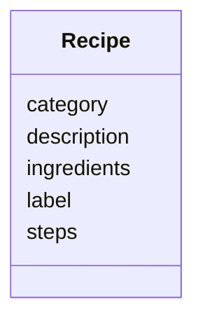

# Class: Recipe


URI: [recipe:Recipe](http://w3id.org/ontogpt/recipe/Recipe)





<!-- no inheritance hierarchy -->


## Slots

| Name | Cardinality and Range | Description | Inheritance |
| ---  | --- | --- | --- |
| [label](label.md) | 0..1 <br/> NONE |  | direct |
| [description](description.md) | 0..1 <br/> NONE | a brief textual description of the recipe | direct |
| [category](category.md) | 0..* <br/> [RecipeCategory](RecipeCategory.md) | a semicolon separated list of the categories to which this recipe belongs | direct |
| [ingredients](ingredients.md) | 0..* <br/> [Ingredient](Ingredient.md) | a semicolon separated list of the ingredients plus quantities of the recipe | direct |
| [steps](steps.md) | 0..* <br/> [Step](Step.md) | a semicolon separated list of the individual steps involved in this recipe | direct |


## Identifier and Mapping Information


### Schema Source


* from schema: https://w3id.org/ontogpt/recipe


## Mappings

| Mapping Type | Mapped Value |
| ---  | ---  |
| self | recipe:Recipe |
| native | recipe:Recipe |


## LinkML Source

<!-- TODO: investigate https://stackoverflow.com/questions/37606292/how-to-create-tabbed-code-blocks-in-mkdocs-or-sphinx -->

### Direct

<details>
```yaml
name: Recipe
from_schema: https://w3id.org/ontogpt/recipe
rank: 1000
attributes:
  label:
    name: label
    description: the name of the recipe
    from_schema: https://w3id.org/ontogpt/recipe
    rank: 1000
  description:
    name: description
    description: a brief textual description of the recipe
    from_schema: https://w3id.org/ontogpt/recipe
    rank: 1000
  category:
    name: category
    description: a semicolon separated list of the categories to which this recipe
      belongs
    from_schema: https://w3id.org/ontogpt/recipe
    rank: 1000
    multivalued: true
    range: RecipeCategory
  ingredients:
    name: ingredients
    description: a semicolon separated list of the ingredients plus quantities of
      the recipe
    from_schema: https://w3id.org/ontogpt/recipe
    rank: 1000
    multivalued: true
    range: Ingredient
  steps:
    name: steps
    description: a semicolon separated list of the individual steps involved in this
      recipe
    from_schema: https://w3id.org/ontogpt/recipe
    rank: 1000
    multivalued: true
    range: Step

```
</details>

### Induced

<details>
```yaml
name: Recipe
from_schema: https://w3id.org/ontogpt/recipe
rank: 1000
attributes:
  label:
    name: label
    description: the name of the recipe
    from_schema: https://w3id.org/ontogpt/recipe
    rank: 1000
    alias: label
    owner: Recipe
    domain_of:
    - Recipe
    - NamedEntity
    range: string
  description:
    name: description
    description: a brief textual description of the recipe
    from_schema: https://w3id.org/ontogpt/recipe
    rank: 1000
    alias: description
    owner: Recipe
    domain_of:
    - Recipe
    range: string
  category:
    name: category
    description: a semicolon separated list of the categories to which this recipe
      belongs
    from_schema: https://w3id.org/ontogpt/recipe
    rank: 1000
    multivalued: true
    alias: category
    owner: Recipe
    domain_of:
    - Recipe
    range: RecipeCategory
  ingredients:
    name: ingredients
    description: a semicolon separated list of the ingredients plus quantities of
      the recipe
    from_schema: https://w3id.org/ontogpt/recipe
    rank: 1000
    multivalued: true
    alias: ingredients
    owner: Recipe
    domain_of:
    - Recipe
    range: Ingredient
  steps:
    name: steps
    description: a semicolon separated list of the individual steps involved in this
      recipe
    from_schema: https://w3id.org/ontogpt/recipe
    rank: 1000
    multivalued: true
    alias: steps
    owner: Recipe
    domain_of:
    - Recipe
    range: Step

```
</details>