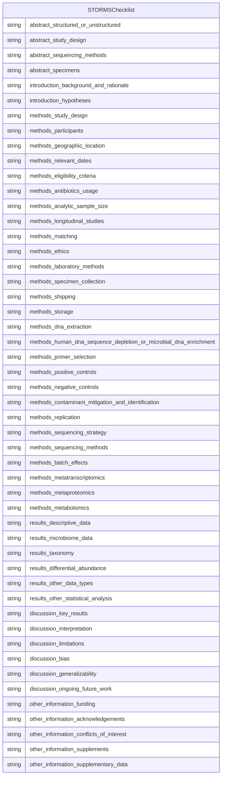

# Class: STORMSChecklist


_A checklist of items that should be reported in a microbiome study. Try and provide a value for ALL items. If an item is not reported, say NOT REPORTED._


URI: [storms:STORMSChecklist](http://w3id.org/ontogpt/storms/STORMSChecklist)





<!-- no inheritance hierarchy -->


## Slots

| Name | Cardinality and Range | Description | Inheritance |
| ---  | --- | --- | --- |
| [abstract_structured_or_unstructured](abstract_structured_or_unstructured.md) | 0..1 <br/> [String](String.md) | Abstract should include information on background, methods, results, and conc... | direct |
| [abstract_study_design](abstract_study_design.md) | 0..1 <br/> [String](String.md) | State study design in abstract | direct |
| [abstract_sequencing_methods](abstract_sequencing_methods.md) | 0..1 <br/> [String](String.md) | State the strategy used for metagenomic classification | direct |
| [abstract_specimens](abstract_specimens.md) | 0..1 <br/> [String](String.md) | Describe body site(s) studied | direct |
| [introduction_background_and_rationale](introduction_background_and_rationale.md) | 0..1 <br/> [String](String.md) | Summarize the underlying background, scientific evidence, or theory driving t... | direct |
| [introduction_hypotheses](introduction_hypotheses.md) | 0..1 <br/> [String](String.md) | State the pre-specified hypothesis | direct |
| [methods_study_design](methods_study_design.md) | 0..1 <br/> [String](String.md) | Describe the study design | direct |
| [methods_participants](methods_participants.md) | 0..1 <br/> [String](String.md) | State what the population of interest is, and the method by which participant... | direct |
| [methods_geographic_location](methods_geographic_location.md) | 0..1 <br/> [String](String.md) | State the geographic region(s) where participants were sampled from | direct |
| [methods_relevant_dates](methods_relevant_dates.md) | 0..1 <br/> [String](String.md) | State the start and end dates for recruitment, follow-up, and data collection | direct |
| [methods_eligibility_criteria](methods_eligibility_criteria.md) | 0..1 <br/> [String](String.md) | List any criteria for inclusion and exclusion of recruited participants | direct |
| [methods_antibiotics_usage](methods_antibiotics_usage.md) | 0..1 <br/> [String](String.md) | List what is known about antibiotics usage before or during sample collection | direct |
| [methods_analytic_sample_size](methods_analytic_sample_size.md) | 0..1 <br/> [String](String.md) | Explain how the final analytic sample size was calculated, including the numb... | direct |
| [methods_longitudinal_studies](methods_longitudinal_studies.md) | 0..1 <br/> [String](String.md) | For longitudinal studies, state how many follow-ups were conducted, describe ... | direct |
| [methods_matching](methods_matching.md) | 0..1 <br/> [String](String.md) | For matched studies, give matching criteria | direct |
| [methods_ethics](methods_ethics.md) | 0..1 <br/> [String](String.md) | State the name of the institutional review board that approved the study and ... | direct |
| [methods_laboratory_methods](methods_laboratory_methods.md) | 0..1 <br/> [String](String.md) | State the laboratory/center where laboratory work was done | direct |
| [methods_specimen_collection](methods_specimen_collection.md) | 0..1 <br/> [String](String.md) | State the body site(s) sampled from and how specimens were collected | direct |
| [methods_shipping](methods_shipping.md) | 0..1 <br/> [String](String.md) | Describe how samples were stored and shipped to the laboratory | direct |
| [methods_storage](methods_storage.md) | 0..1 <br/> [String](String.md) | Describe how the laboratory stored samples, including time between collection... | direct |
| [methods_dna_extraction](methods_dna_extraction.md) | 0..1 <br/> [String](String.md) | Provide DNA extraction method, including kit and version if relevant | direct |
| [methods_human_dna_sequence_depletion_or_microbial_dna_enrichment](methods_human_dna_sequence_depletion_or_microbial_dna_enrichment.md) | 0..1 <br/> [String](String.md) | Describe whether human DNA sequence depletion or enrichment of microbial or v... | direct |
| [methods_primer_selection](methods_primer_selection.md) | 0..1 <br/> [String](String.md) | Provide primer selection and DNA amplification methods as well as variable re... | direct |
| [methods_positive_controls](methods_positive_controls.md) | 0..1 <br/> [String](String.md) | Describe any positive controls (mock communities) if used | direct |
| [methods_negative_controls](methods_negative_controls.md) | 0..1 <br/> [String](String.md) | Describe any negative controls if used | direct |
| [methods_contaminant_mitigation_and_identification](methods_contaminant_mitigation_and_identification.md) | 0..1 <br/> [String](String.md) | Provide any laboratory or computational methods used to control for or identi... | direct |
| [methods_replication](methods_replication.md) | 0..1 <br/> [String](String.md) | Describe any biological or technical replicates included in the sequencing, i... | direct |
| [methods_sequencing_strategy](methods_sequencing_strategy.md) | 0..1 <br/> [String](String.md) | Major divisions of strategy, such as shotgun or amplicon sequencing | direct |
| [methods_sequencing_methods](methods_sequencing_methods.md) | 0..1 <br/> [String](String.md) | State whether experimental quantification was used (QMP/cell count based, spi... | direct |
| [methods_batch_effects](methods_batch_effects.md) | 0..1 <br/> [String](String.md) | Detail any blocking or randomization used in study design to avoid confoundin... | direct |
| [methods_metatranscriptomics](methods_metatranscriptomics.md) | 0..1 <br/> [String](String.md) | Detail whether any mRNA enrichment was performed and whether/how retrotranscr... | direct |
| [methods_metaproteomics](methods_metaproteomics.md) | 0..1 <br/> [String](String.md) | Detail which protease was used for digestion | direct |
| [methods_metabolomics](methods_metabolomics.md) | 0..1 <br/> [String](String.md) | Specify the analytic method used (such as nuclear magnetic resonance spectros... | direct |
| [results_descriptive_data](results_descriptive_data.md) | 0..1 <br/> [String](String.md) | Give characteristics of study participants (e | direct |
| [results_microbiome_data](results_microbiome_data.md) | 0..1 <br/> [String](String.md) | Report descriptive findings for microbiome analyses with all applicable outco... | direct |
| [results_taxonomy](results_taxonomy.md) | 0..1 <br/> [String](String.md) | Identify taxonomy using standardized taxon classifications that are sufficien... | direct |
| [results_differential_abundance](results_differential_abundance.md) | 0..1 <br/> [String](String.md) | Report results of differential abundance analysis by the variable of interest... | direct |
| [results_other_data_types](results_other_data_types.md) | 0..1 <br/> [String](String.md) | Report other data analyzed--e | direct |
| [results_other_statistical_analysis](results_other_statistical_analysis.md) | 0..1 <br/> [String](String.md) | Report any statistical data analysis not covered above | direct |
| [discussion_key_results](discussion_key_results.md) | 0..1 <br/> [String](String.md) | Summarize key results with reference to study objectives | direct |
| [discussion_interpretation](discussion_interpretation.md) | 0..1 <br/> [String](String.md) | Give a cautious overall interpretation of results considering objectives, lim... | direct |
| [discussion_limitations](discussion_limitations.md) | 0..1 <br/> [String](String.md) | Discuss limitations of the study, taking into account sources of potential bi... | direct |
| [discussion_bias](discussion_bias.md) | 0..1 <br/> [String](String.md) | Discuss any potential for bias to influence study findings | direct |
| [discussion_generalizability](discussion_generalizability.md) | 0..1 <br/> [String](String.md) | Discuss the generalizability (external validity) of the study results | direct |
| [discussion_ongoing_future_work](discussion_ongoing_future_work.md) | 0..1 <br/> [String](String.md) | Describe potential future research or ongoing research based on the study's f... | direct |
| [other_information_funding](other_information_funding.md) | 0..1 <br/> [String](String.md) | Give the source of funding and the role of the funders for the present study ... | direct |
| [other_information_acknowledgements](other_information_acknowledgements.md) | 0..1 <br/> [String](String.md) | Include acknowledgements of those who contributed to the research but did not... | direct |
| [other_information_conflicts_of_interest](other_information_conflicts_of_interest.md) | 0..1 <br/> [String](String.md) | Include a conflicts of interest statement | direct |
| [other_information_supplements](other_information_supplements.md) | 0..1 <br/> [String](String.md) | Indicate where supplements may be accessed and what materials they contain | direct |
| [other_information_supplementary_data](other_information_supplementary_data.md) | 0..1 <br/> [String](String.md) | Provide supplementary data files of results with all taxa and all outcome var... | direct |


## Identifier and Mapping Information


### Annotations

| property | value |
| --- | --- |
| prompt | Try and provide a value for ALL items. If an item is not reported, say NOT REPORTED |


### Schema Source


* from schema: https://w3id.org/ontogpt/storms


## Mappings

| Mapping Type | Mapped Value |
| ---  | ---  |
| self | storms:STORMSChecklist |
| native | storms:STORMSChecklist |


## LinkML Source

<!-- TODO: investigate https://stackoverflow.com/questions/37606292/how-to-create-tabbed-code-blocks-in-mkdocs-or-sphinx -->

### Direct

<details>
```yaml
name: STORMSChecklist
annotations:
  prompt:
    tag: prompt
    value: Try and provide a value for ALL items. If an item is not reported, say
      NOT REPORTED
description: A checklist of items that should be reported in a microbiome study. Try
  and provide a value for ALL items. If an item is not reported, say NOT REPORTED.
from_schema: https://w3id.org/ontogpt/storms
attributes:
  abstract_structured_or_unstructured:
    name: abstract_structured_or_unstructured
    description: Abstract should include information on background, methods, results,
      and conclusions in structured or unstructured format.
    from_schema: https://w3id.org/ontogpt/storms
    rank: 1000
    domain_of:
    - STORMSChecklist
    slot_group: abstract
    range: string
  abstract_study_design:
    name: abstract_study_design
    description: State study design in abstract.
    from_schema: https://w3id.org/ontogpt/storms
    rank: 1000
    domain_of:
    - STORMSChecklist
    slot_group: abstract
    range: string
  abstract_sequencing_methods:
    name: abstract_sequencing_methods
    description: State the strategy used for metagenomic classification.
    from_schema: https://w3id.org/ontogpt/storms
    rank: 1000
    domain_of:
    - STORMSChecklist
    slot_group: abstract
    range: string
  abstract_specimens:
    name: abstract_specimens
    description: Describe body site(s) studied.
    from_schema: https://w3id.org/ontogpt/storms
    rank: 1000
    domain_of:
    - STORMSChecklist
    slot_group: abstract
    range: string
  introduction_background_and_rationale:
    name: introduction_background_and_rationale
    description: Summarize the underlying background, scientific evidence, or theory
      driving the current hypothesis as well as the study objectives.
    from_schema: https://w3id.org/ontogpt/storms
    rank: 1000
    domain_of:
    - STORMSChecklist
    slot_group: introduction
    range: string
  introduction_hypotheses:
    name: introduction_hypotheses
    description: State the pre-specified hypothesis. If the study is exploratory,
      state any pre-specified study objectives.
    from_schema: https://w3id.org/ontogpt/storms
    rank: 1000
    domain_of:
    - STORMSChecklist
    slot_group: introduction
    range: string
  methods_study_design:
    name: methods_study_design
    description: Describe the study design.
    from_schema: https://w3id.org/ontogpt/storms
    rank: 1000
    domain_of:
    - STORMSChecklist
    slot_group: methods
    range: string
  methods_participants:
    name: methods_participants
    description: State what the population of interest is, and the method by which
      participants are sampled from that population.
    from_schema: https://w3id.org/ontogpt/storms
    rank: 1000
    domain_of:
    - STORMSChecklist
    slot_group: methods
    range: string
  methods_geographic_location:
    name: methods_geographic_location
    description: State the geographic region(s) where participants were sampled from.
    from_schema: https://w3id.org/ontogpt/storms
    rank: 1000
    domain_of:
    - STORMSChecklist
    slot_group: methods
    range: string
  methods_relevant_dates:
    name: methods_relevant_dates
    description: State the start and end dates for recruitment, follow-up, and data
      collection.
    from_schema: https://w3id.org/ontogpt/storms
    rank: 1000
    domain_of:
    - STORMSChecklist
    slot_group: methods
    range: string
  methods_eligibility_criteria:
    name: methods_eligibility_criteria
    description: List any criteria for inclusion and exclusion of recruited participants.
    from_schema: https://w3id.org/ontogpt/storms
    rank: 1000
    domain_of:
    - STORMSChecklist
    slot_group: methods
    range: string
  methods_antibiotics_usage:
    name: methods_antibiotics_usage
    description: List what is known about antibiotics usage before or during sample
      collection.
    from_schema: https://w3id.org/ontogpt/storms
    rank: 1000
    domain_of:
    - STORMSChecklist
    slot_group: methods
    range: string
  methods_analytic_sample_size:
    name: methods_analytic_sample_size
    description: Explain how the final analytic sample size was calculated, including
      the number of cases and controls if relevant, and reasons for dropout at each
      stage of the study.
    from_schema: https://w3id.org/ontogpt/storms
    rank: 1000
    domain_of:
    - STORMSChecklist
    slot_group: methods
    range: string
  methods_longitudinal_studies:
    name: methods_longitudinal_studies
    description: For longitudinal studies, state how many follow-ups were conducted,
      describe sample size at follow-up by group or condition, and discuss any loss
      to follow-up.
    from_schema: https://w3id.org/ontogpt/storms
    rank: 1000
    domain_of:
    - STORMSChecklist
    slot_group: methods
    range: string
  methods_matching:
    name: methods_matching
    description: For matched studies, give matching criteria.
    from_schema: https://w3id.org/ontogpt/storms
    rank: 1000
    domain_of:
    - STORMSChecklist
    slot_group: methods
    range: string
  methods_ethics:
    name: methods_ethics
    description: State the name of the institutional review board that approved the
      study and protocols, protocol number and date of approval, and procedures for
      obtaining informed consent from participants.
    from_schema: https://w3id.org/ontogpt/storms
    rank: 1000
    domain_of:
    - STORMSChecklist
    slot_group: methods
    range: string
  methods_laboratory_methods:
    name: methods_laboratory_methods
    description: State the laboratory/center where laboratory work was done.
    from_schema: https://w3id.org/ontogpt/storms
    rank: 1000
    domain_of:
    - STORMSChecklist
    slot_group: methods
    range: string
  methods_specimen_collection:
    name: methods_specimen_collection
    description: State the body site(s) sampled from and how specimens were collected.
    from_schema: https://w3id.org/ontogpt/storms
    rank: 1000
    domain_of:
    - STORMSChecklist
    slot_group: methods
    range: string
  methods_shipping:
    name: methods_shipping
    description: Describe how samples were stored and shipped to the laboratory.
    from_schema: https://w3id.org/ontogpt/storms
    rank: 1000
    domain_of:
    - STORMSChecklist
    slot_group: methods
    range: string
  methods_storage:
    name: methods_storage
    description: Describe how the laboratory stored samples, including time between
      collection and storage and any preservation buffers or refrigeration used.
    from_schema: https://w3id.org/ontogpt/storms
    rank: 1000
    domain_of:
    - STORMSChecklist
    slot_group: methods
    range: string
  methods_dna_extraction:
    name: methods_dna_extraction
    description: Provide DNA extraction method, including kit and version if relevant.
    from_schema: https://w3id.org/ontogpt/storms
    rank: 1000
    domain_of:
    - STORMSChecklist
    slot_group: methods
    range: string
  methods_human_dna_sequence_depletion_or_microbial_dna_enrichment:
    name: methods_human_dna_sequence_depletion_or_microbial_dna_enrichment
    description: Describe whether human DNA sequence depletion or enrichment of microbial
      or viral DNA was performed.
    from_schema: https://w3id.org/ontogpt/storms
    rank: 1000
    domain_of:
    - STORMSChecklist
    slot_group: methods
    range: string
  methods_primer_selection:
    name: methods_primer_selection
    description: Provide primer selection and DNA amplification methods as well as
      variable region sequenced (if applicable).
    from_schema: https://w3id.org/ontogpt/storms
    rank: 1000
    domain_of:
    - STORMSChecklist
    slot_group: methods
    range: string
  methods_positive_controls:
    name: methods_positive_controls
    description: Describe any positive controls (mock communities) if used.
    from_schema: https://w3id.org/ontogpt/storms
    rank: 1000
    domain_of:
    - STORMSChecklist
    slot_group: methods
    range: string
  methods_negative_controls:
    name: methods_negative_controls
    description: Describe any negative controls if used.
    from_schema: https://w3id.org/ontogpt/storms
    rank: 1000
    domain_of:
    - STORMSChecklist
    slot_group: methods
    range: string
  methods_contaminant_mitigation_and_identification:
    name: methods_contaminant_mitigation_and_identification
    description: Provide any laboratory or computational methods used to control for
      or identify microbiome contamination from the environment, reagents, or laboratory.
    from_schema: https://w3id.org/ontogpt/storms
    rank: 1000
    domain_of:
    - STORMSChecklist
    slot_group: methods
    range: string
  methods_replication:
    name: methods_replication
    description: Describe any biological or technical replicates included in the sequencing,
      including which steps were replicated between them.
    from_schema: https://w3id.org/ontogpt/storms
    rank: 1000
    domain_of:
    - STORMSChecklist
    slot_group: methods
    range: string
  methods_sequencing_strategy:
    name: methods_sequencing_strategy
    description: Major divisions of strategy, such as shotgun or amplicon sequencing.
    from_schema: https://w3id.org/ontogpt/storms
    rank: 1000
    domain_of:
    - STORMSChecklist
    slot_group: methods
    range: string
  methods_sequencing_methods:
    name: methods_sequencing_methods
    description: State whether experimental quantification was used (QMP/cell count
      based, spike-in based) or whether relative abundance methods were applied.
    from_schema: https://w3id.org/ontogpt/storms
    rank: 1000
    domain_of:
    - STORMSChecklist
    slot_group: methods
    range: string
  methods_batch_effects:
    name: methods_batch_effects
    description: Detail any blocking or randomization used in study design to avoid
      confounding of batches with exposures or outcomes. Discuss any likely sources
      of batch effects, if known.
    from_schema: https://w3id.org/ontogpt/storms
    rank: 1000
    domain_of:
    - STORMSChecklist
    slot_group: methods
    range: string
  methods_metatranscriptomics:
    name: methods_metatranscriptomics
    description: Detail whether any mRNA enrichment was performed and whether/how
      retrotranscription was performed prior to sequencing. Provide size range of
      isolated transcripts. Describe whether the sequencing library was stranded or
      not. Provide details on sequencing methods and platforms.
    from_schema: https://w3id.org/ontogpt/storms
    rank: 1000
    domain_of:
    - STORMSChecklist
    slot_group: methods
    range: string
  methods_metaproteomics:
    name: methods_metaproteomics
    description: Detail which protease was used for digestion. Provide details on
      proteomic methods and platforms (e.g. LC-MS/MS, instrument type, column type,
      mass range, resolution, scan speed, maximum injection time, isolation window,
      normalised collision energy, and resolution).
    from_schema: https://w3id.org/ontogpt/storms
    rank: 1000
    domain_of:
    - STORMSChecklist
    slot_group: methods
    range: string
  methods_metabolomics:
    name: methods_metabolomics
    description: Specify the analytic method used (such as nuclear magnetic resonance
      spectroscopy or mass spectrometry). For mass spectrometry, detail which fractions
      were obtained (polar and/or non polar) and how these were analyzed. Provide
      details on metabolomics methods and platforms (e.g. derivatization, instrument
      type, injection type, column type and instrument settings).
    from_schema: https://w3id.org/ontogpt/storms
    rank: 1000
    domain_of:
    - STORMSChecklist
    slot_group: methods
    range: string
  results_descriptive_data:
    name: results_descriptive_data
    description: Give characteristics of study participants (e.g. dietary, demographic,
      clinical, social) and information on exposures and potential confounders.
    from_schema: https://w3id.org/ontogpt/storms
    rank: 1000
    domain_of:
    - STORMSChecklist
    slot_group: results
    range: string
  results_microbiome_data:
    name: results_microbiome_data
    description: Report descriptive findings for microbiome analyses with all applicable
      outcomes and covariates.
    from_schema: https://w3id.org/ontogpt/storms
    rank: 1000
    domain_of:
    - STORMSChecklist
    slot_group: results
    range: string
  results_taxonomy:
    name: results_taxonomy
    description: Identify taxonomy using standardized taxon classifications that are
      sufficient to uniquely identify taxa.
    from_schema: https://w3id.org/ontogpt/storms
    rank: 1000
    domain_of:
    - STORMSChecklist
    slot_group: results
    range: string
  results_differential_abundance:
    name: results_differential_abundance
    description: Report results of differential abundance analysis by the variable
      of interest and (if applicable) by time, clearly indicating the direction of
      change and total number of taxa tested.
    from_schema: https://w3id.org/ontogpt/storms
    rank: 1000
    domain_of:
    - STORMSChecklist
    slot_group: results
    range: string
  results_other_data_types:
    name: results_other_data_types
    description: Report other data analyzed--e.g. metabolic function, functional potential,
      MAG assembly, and RNAseq.
    from_schema: https://w3id.org/ontogpt/storms
    rank: 1000
    domain_of:
    - STORMSChecklist
    slot_group: results
    range: string
  results_other_statistical_analysis:
    name: results_other_statistical_analysis
    description: Report any statistical data analysis not covered above.
    from_schema: https://w3id.org/ontogpt/storms
    rank: 1000
    domain_of:
    - STORMSChecklist
    slot_group: results
    range: string
  discussion_key_results:
    name: discussion_key_results
    description: Summarize key results with reference to study objectives.
    from_schema: https://w3id.org/ontogpt/storms
    rank: 1000
    domain_of:
    - STORMSChecklist
    slot_group: discussion
    range: string
  discussion_interpretation:
    name: discussion_interpretation
    description: Give a cautious overall interpretation of results considering objectives,
      limitations, multiplicity of analyses, results from similar studies, and other
      relevant evidence.
    from_schema: https://w3id.org/ontogpt/storms
    rank: 1000
    domain_of:
    - STORMSChecklist
    slot_group: discussion
    range: string
  discussion_limitations:
    name: discussion_limitations
    description: Discuss limitations of the study, taking into account sources of
      potential bias or imprecision.
    from_schema: https://w3id.org/ontogpt/storms
    rank: 1000
    domain_of:
    - STORMSChecklist
    slot_group: discussion
    range: string
  discussion_bias:
    name: discussion_bias
    description: Discuss any potential for bias to influence study findings.
    from_schema: https://w3id.org/ontogpt/storms
    rank: 1000
    domain_of:
    - STORMSChecklist
    slot_group: discussion
    range: string
  discussion_generalizability:
    name: discussion_generalizability
    description: Discuss the generalizability (external validity) of the study results.
    from_schema: https://w3id.org/ontogpt/storms
    rank: 1000
    domain_of:
    - STORMSChecklist
    slot_group: discussion
    range: string
  discussion_ongoing_future_work:
    name: discussion_ongoing_future_work
    description: Describe potential future research or ongoing research based on the
      study's findings.
    from_schema: https://w3id.org/ontogpt/storms
    rank: 1000
    domain_of:
    - STORMSChecklist
    slot_group: discussion
    range: string
  other_information_funding:
    name: other_information_funding
    description: Give the source of funding and the role of the funders for the present
      study and, if applicable, for the original study on which the present article
      is based.
    from_schema: https://w3id.org/ontogpt/storms
    rank: 1000
    domain_of:
    - STORMSChecklist
    slot_group: other_information
    range: string
  other_information_acknowledgements:
    name: other_information_acknowledgements
    description: Include acknowledgements of those who contributed to the research
      but did not meet criteria for authorship.
    from_schema: https://w3id.org/ontogpt/storms
    rank: 1000
    domain_of:
    - STORMSChecklist
    slot_group: other_information
    range: string
  other_information_conflicts_of_interest:
    name: other_information_conflicts_of_interest
    description: Include a conflicts of interest statement.
    from_schema: https://w3id.org/ontogpt/storms
    rank: 1000
    domain_of:
    - STORMSChecklist
    slot_group: other_information
    range: string
  other_information_supplements:
    name: other_information_supplements
    description: Indicate where supplements may be accessed and what materials they
      contain.
    from_schema: https://w3id.org/ontogpt/storms
    rank: 1000
    domain_of:
    - STORMSChecklist
    slot_group: other_information
    range: string
  other_information_supplementary_data:
    name: other_information_supplementary_data
    description: Provide supplementary data files of results with all taxa and all
      outcome variables analyzed. Indicate the taxonomic level of all taxa.
    from_schema: https://w3id.org/ontogpt/storms
    rank: 1000
    domain_of:
    - STORMSChecklist
    slot_group: other_information
    range: string
tree_root: true

```
</details>

### Induced

<details>
```yaml
name: STORMSChecklist
annotations:
  prompt:
    tag: prompt
    value: Try and provide a value for ALL items. If an item is not reported, say
      NOT REPORTED
description: A checklist of items that should be reported in a microbiome study. Try
  and provide a value for ALL items. If an item is not reported, say NOT REPORTED.
from_schema: https://w3id.org/ontogpt/storms
attributes:
  abstract_structured_or_unstructured:
    name: abstract_structured_or_unstructured
    description: Abstract should include information on background, methods, results,
      and conclusions in structured or unstructured format.
    from_schema: https://w3id.org/ontogpt/storms
    rank: 1000
    alias: abstract_structured_or_unstructured
    owner: STORMSChecklist
    domain_of:
    - STORMSChecklist
    slot_group: abstract
    range: string
  abstract_study_design:
    name: abstract_study_design
    description: State study design in abstract.
    from_schema: https://w3id.org/ontogpt/storms
    rank: 1000
    alias: abstract_study_design
    owner: STORMSChecklist
    domain_of:
    - STORMSChecklist
    slot_group: abstract
    range: string
  abstract_sequencing_methods:
    name: abstract_sequencing_methods
    description: State the strategy used for metagenomic classification.
    from_schema: https://w3id.org/ontogpt/storms
    rank: 1000
    alias: abstract_sequencing_methods
    owner: STORMSChecklist
    domain_of:
    - STORMSChecklist
    slot_group: abstract
    range: string
  abstract_specimens:
    name: abstract_specimens
    description: Describe body site(s) studied.
    from_schema: https://w3id.org/ontogpt/storms
    rank: 1000
    alias: abstract_specimens
    owner: STORMSChecklist
    domain_of:
    - STORMSChecklist
    slot_group: abstract
    range: string
  introduction_background_and_rationale:
    name: introduction_background_and_rationale
    description: Summarize the underlying background, scientific evidence, or theory
      driving the current hypothesis as well as the study objectives.
    from_schema: https://w3id.org/ontogpt/storms
    rank: 1000
    alias: introduction_background_and_rationale
    owner: STORMSChecklist
    domain_of:
    - STORMSChecklist
    slot_group: introduction
    range: string
  introduction_hypotheses:
    name: introduction_hypotheses
    description: State the pre-specified hypothesis. If the study is exploratory,
      state any pre-specified study objectives.
    from_schema: https://w3id.org/ontogpt/storms
    rank: 1000
    alias: introduction_hypotheses
    owner: STORMSChecklist
    domain_of:
    - STORMSChecklist
    slot_group: introduction
    range: string
  methods_study_design:
    name: methods_study_design
    description: Describe the study design.
    from_schema: https://w3id.org/ontogpt/storms
    rank: 1000
    alias: methods_study_design
    owner: STORMSChecklist
    domain_of:
    - STORMSChecklist
    slot_group: methods
    range: string
  methods_participants:
    name: methods_participants
    description: State what the population of interest is, and the method by which
      participants are sampled from that population.
    from_schema: https://w3id.org/ontogpt/storms
    rank: 1000
    alias: methods_participants
    owner: STORMSChecklist
    domain_of:
    - STORMSChecklist
    slot_group: methods
    range: string
  methods_geographic_location:
    name: methods_geographic_location
    description: State the geographic region(s) where participants were sampled from.
    from_schema: https://w3id.org/ontogpt/storms
    rank: 1000
    alias: methods_geographic_location
    owner: STORMSChecklist
    domain_of:
    - STORMSChecklist
    slot_group: methods
    range: string
  methods_relevant_dates:
    name: methods_relevant_dates
    description: State the start and end dates for recruitment, follow-up, and data
      collection.
    from_schema: https://w3id.org/ontogpt/storms
    rank: 1000
    alias: methods_relevant_dates
    owner: STORMSChecklist
    domain_of:
    - STORMSChecklist
    slot_group: methods
    range: string
  methods_eligibility_criteria:
    name: methods_eligibility_criteria
    description: List any criteria for inclusion and exclusion of recruited participants.
    from_schema: https://w3id.org/ontogpt/storms
    rank: 1000
    alias: methods_eligibility_criteria
    owner: STORMSChecklist
    domain_of:
    - STORMSChecklist
    slot_group: methods
    range: string
  methods_antibiotics_usage:
    name: methods_antibiotics_usage
    description: List what is known about antibiotics usage before or during sample
      collection.
    from_schema: https://w3id.org/ontogpt/storms
    rank: 1000
    alias: methods_antibiotics_usage
    owner: STORMSChecklist
    domain_of:
    - STORMSChecklist
    slot_group: methods
    range: string
  methods_analytic_sample_size:
    name: methods_analytic_sample_size
    description: Explain how the final analytic sample size was calculated, including
      the number of cases and controls if relevant, and reasons for dropout at each
      stage of the study.
    from_schema: https://w3id.org/ontogpt/storms
    rank: 1000
    alias: methods_analytic_sample_size
    owner: STORMSChecklist
    domain_of:
    - STORMSChecklist
    slot_group: methods
    range: string
  methods_longitudinal_studies:
    name: methods_longitudinal_studies
    description: For longitudinal studies, state how many follow-ups were conducted,
      describe sample size at follow-up by group or condition, and discuss any loss
      to follow-up.
    from_schema: https://w3id.org/ontogpt/storms
    rank: 1000
    alias: methods_longitudinal_studies
    owner: STORMSChecklist
    domain_of:
    - STORMSChecklist
    slot_group: methods
    range: string
  methods_matching:
    name: methods_matching
    description: For matched studies, give matching criteria.
    from_schema: https://w3id.org/ontogpt/storms
    rank: 1000
    alias: methods_matching
    owner: STORMSChecklist
    domain_of:
    - STORMSChecklist
    slot_group: methods
    range: string
  methods_ethics:
    name: methods_ethics
    description: State the name of the institutional review board that approved the
      study and protocols, protocol number and date of approval, and procedures for
      obtaining informed consent from participants.
    from_schema: https://w3id.org/ontogpt/storms
    rank: 1000
    alias: methods_ethics
    owner: STORMSChecklist
    domain_of:
    - STORMSChecklist
    slot_group: methods
    range: string
  methods_laboratory_methods:
    name: methods_laboratory_methods
    description: State the laboratory/center where laboratory work was done.
    from_schema: https://w3id.org/ontogpt/storms
    rank: 1000
    alias: methods_laboratory_methods
    owner: STORMSChecklist
    domain_of:
    - STORMSChecklist
    slot_group: methods
    range: string
  methods_specimen_collection:
    name: methods_specimen_collection
    description: State the body site(s) sampled from and how specimens were collected.
    from_schema: https://w3id.org/ontogpt/storms
    rank: 1000
    alias: methods_specimen_collection
    owner: STORMSChecklist
    domain_of:
    - STORMSChecklist
    slot_group: methods
    range: string
  methods_shipping:
    name: methods_shipping
    description: Describe how samples were stored and shipped to the laboratory.
    from_schema: https://w3id.org/ontogpt/storms
    rank: 1000
    alias: methods_shipping
    owner: STORMSChecklist
    domain_of:
    - STORMSChecklist
    slot_group: methods
    range: string
  methods_storage:
    name: methods_storage
    description: Describe how the laboratory stored samples, including time between
      collection and storage and any preservation buffers or refrigeration used.
    from_schema: https://w3id.org/ontogpt/storms
    rank: 1000
    alias: methods_storage
    owner: STORMSChecklist
    domain_of:
    - STORMSChecklist
    slot_group: methods
    range: string
  methods_dna_extraction:
    name: methods_dna_extraction
    description: Provide DNA extraction method, including kit and version if relevant.
    from_schema: https://w3id.org/ontogpt/storms
    rank: 1000
    alias: methods_dna_extraction
    owner: STORMSChecklist
    domain_of:
    - STORMSChecklist
    slot_group: methods
    range: string
  methods_human_dna_sequence_depletion_or_microbial_dna_enrichment:
    name: methods_human_dna_sequence_depletion_or_microbial_dna_enrichment
    description: Describe whether human DNA sequence depletion or enrichment of microbial
      or viral DNA was performed.
    from_schema: https://w3id.org/ontogpt/storms
    rank: 1000
    alias: methods_human_dna_sequence_depletion_or_microbial_dna_enrichment
    owner: STORMSChecklist
    domain_of:
    - STORMSChecklist
    slot_group: methods
    range: string
  methods_primer_selection:
    name: methods_primer_selection
    description: Provide primer selection and DNA amplification methods as well as
      variable region sequenced (if applicable).
    from_schema: https://w3id.org/ontogpt/storms
    rank: 1000
    alias: methods_primer_selection
    owner: STORMSChecklist
    domain_of:
    - STORMSChecklist
    slot_group: methods
    range: string
  methods_positive_controls:
    name: methods_positive_controls
    description: Describe any positive controls (mock communities) if used.
    from_schema: https://w3id.org/ontogpt/storms
    rank: 1000
    alias: methods_positive_controls
    owner: STORMSChecklist
    domain_of:
    - STORMSChecklist
    slot_group: methods
    range: string
  methods_negative_controls:
    name: methods_negative_controls
    description: Describe any negative controls if used.
    from_schema: https://w3id.org/ontogpt/storms
    rank: 1000
    alias: methods_negative_controls
    owner: STORMSChecklist
    domain_of:
    - STORMSChecklist
    slot_group: methods
    range: string
  methods_contaminant_mitigation_and_identification:
    name: methods_contaminant_mitigation_and_identification
    description: Provide any laboratory or computational methods used to control for
      or identify microbiome contamination from the environment, reagents, or laboratory.
    from_schema: https://w3id.org/ontogpt/storms
    rank: 1000
    alias: methods_contaminant_mitigation_and_identification
    owner: STORMSChecklist
    domain_of:
    - STORMSChecklist
    slot_group: methods
    range: string
  methods_replication:
    name: methods_replication
    description: Describe any biological or technical replicates included in the sequencing,
      including which steps were replicated between them.
    from_schema: https://w3id.org/ontogpt/storms
    rank: 1000
    alias: methods_replication
    owner: STORMSChecklist
    domain_of:
    - STORMSChecklist
    slot_group: methods
    range: string
  methods_sequencing_strategy:
    name: methods_sequencing_strategy
    description: Major divisions of strategy, such as shotgun or amplicon sequencing.
    from_schema: https://w3id.org/ontogpt/storms
    rank: 1000
    alias: methods_sequencing_strategy
    owner: STORMSChecklist
    domain_of:
    - STORMSChecklist
    slot_group: methods
    range: string
  methods_sequencing_methods:
    name: methods_sequencing_methods
    description: State whether experimental quantification was used (QMP/cell count
      based, spike-in based) or whether relative abundance methods were applied.
    from_schema: https://w3id.org/ontogpt/storms
    rank: 1000
    alias: methods_sequencing_methods
    owner: STORMSChecklist
    domain_of:
    - STORMSChecklist
    slot_group: methods
    range: string
  methods_batch_effects:
    name: methods_batch_effects
    description: Detail any blocking or randomization used in study design to avoid
      confounding of batches with exposures or outcomes. Discuss any likely sources
      of batch effects, if known.
    from_schema: https://w3id.org/ontogpt/storms
    rank: 1000
    alias: methods_batch_effects
    owner: STORMSChecklist
    domain_of:
    - STORMSChecklist
    slot_group: methods
    range: string
  methods_metatranscriptomics:
    name: methods_metatranscriptomics
    description: Detail whether any mRNA enrichment was performed and whether/how
      retrotranscription was performed prior to sequencing. Provide size range of
      isolated transcripts. Describe whether the sequencing library was stranded or
      not. Provide details on sequencing methods and platforms.
    from_schema: https://w3id.org/ontogpt/storms
    rank: 1000
    alias: methods_metatranscriptomics
    owner: STORMSChecklist
    domain_of:
    - STORMSChecklist
    slot_group: methods
    range: string
  methods_metaproteomics:
    name: methods_metaproteomics
    description: Detail which protease was used for digestion. Provide details on
      proteomic methods and platforms (e.g. LC-MS/MS, instrument type, column type,
      mass range, resolution, scan speed, maximum injection time, isolation window,
      normalised collision energy, and resolution).
    from_schema: https://w3id.org/ontogpt/storms
    rank: 1000
    alias: methods_metaproteomics
    owner: STORMSChecklist
    domain_of:
    - STORMSChecklist
    slot_group: methods
    range: string
  methods_metabolomics:
    name: methods_metabolomics
    description: Specify the analytic method used (such as nuclear magnetic resonance
      spectroscopy or mass spectrometry). For mass spectrometry, detail which fractions
      were obtained (polar and/or non polar) and how these were analyzed. Provide
      details on metabolomics methods and platforms (e.g. derivatization, instrument
      type, injection type, column type and instrument settings).
    from_schema: https://w3id.org/ontogpt/storms
    rank: 1000
    alias: methods_metabolomics
    owner: STORMSChecklist
    domain_of:
    - STORMSChecklist
    slot_group: methods
    range: string
  results_descriptive_data:
    name: results_descriptive_data
    description: Give characteristics of study participants (e.g. dietary, demographic,
      clinical, social) and information on exposures and potential confounders.
    from_schema: https://w3id.org/ontogpt/storms
    rank: 1000
    alias: results_descriptive_data
    owner: STORMSChecklist
    domain_of:
    - STORMSChecklist
    slot_group: results
    range: string
  results_microbiome_data:
    name: results_microbiome_data
    description: Report descriptive findings for microbiome analyses with all applicable
      outcomes and covariates.
    from_schema: https://w3id.org/ontogpt/storms
    rank: 1000
    alias: results_microbiome_data
    owner: STORMSChecklist
    domain_of:
    - STORMSChecklist
    slot_group: results
    range: string
  results_taxonomy:
    name: results_taxonomy
    description: Identify taxonomy using standardized taxon classifications that are
      sufficient to uniquely identify taxa.
    from_schema: https://w3id.org/ontogpt/storms
    rank: 1000
    alias: results_taxonomy
    owner: STORMSChecklist
    domain_of:
    - STORMSChecklist
    slot_group: results
    range: string
  results_differential_abundance:
    name: results_differential_abundance
    description: Report results of differential abundance analysis by the variable
      of interest and (if applicable) by time, clearly indicating the direction of
      change and total number of taxa tested.
    from_schema: https://w3id.org/ontogpt/storms
    rank: 1000
    alias: results_differential_abundance
    owner: STORMSChecklist
    domain_of:
    - STORMSChecklist
    slot_group: results
    range: string
  results_other_data_types:
    name: results_other_data_types
    description: Report other data analyzed--e.g. metabolic function, functional potential,
      MAG assembly, and RNAseq.
    from_schema: https://w3id.org/ontogpt/storms
    rank: 1000
    alias: results_other_data_types
    owner: STORMSChecklist
    domain_of:
    - STORMSChecklist
    slot_group: results
    range: string
  results_other_statistical_analysis:
    name: results_other_statistical_analysis
    description: Report any statistical data analysis not covered above.
    from_schema: https://w3id.org/ontogpt/storms
    rank: 1000
    alias: results_other_statistical_analysis
    owner: STORMSChecklist
    domain_of:
    - STORMSChecklist
    slot_group: results
    range: string
  discussion_key_results:
    name: discussion_key_results
    description: Summarize key results with reference to study objectives.
    from_schema: https://w3id.org/ontogpt/storms
    rank: 1000
    alias: discussion_key_results
    owner: STORMSChecklist
    domain_of:
    - STORMSChecklist
    slot_group: discussion
    range: string
  discussion_interpretation:
    name: discussion_interpretation
    description: Give a cautious overall interpretation of results considering objectives,
      limitations, multiplicity of analyses, results from similar studies, and other
      relevant evidence.
    from_schema: https://w3id.org/ontogpt/storms
    rank: 1000
    alias: discussion_interpretation
    owner: STORMSChecklist
    domain_of:
    - STORMSChecklist
    slot_group: discussion
    range: string
  discussion_limitations:
    name: discussion_limitations
    description: Discuss limitations of the study, taking into account sources of
      potential bias or imprecision.
    from_schema: https://w3id.org/ontogpt/storms
    rank: 1000
    alias: discussion_limitations
    owner: STORMSChecklist
    domain_of:
    - STORMSChecklist
    slot_group: discussion
    range: string
  discussion_bias:
    name: discussion_bias
    description: Discuss any potential for bias to influence study findings.
    from_schema: https://w3id.org/ontogpt/storms
    rank: 1000
    alias: discussion_bias
    owner: STORMSChecklist
    domain_of:
    - STORMSChecklist
    slot_group: discussion
    range: string
  discussion_generalizability:
    name: discussion_generalizability
    description: Discuss the generalizability (external validity) of the study results.
    from_schema: https://w3id.org/ontogpt/storms
    rank: 1000
    alias: discussion_generalizability
    owner: STORMSChecklist
    domain_of:
    - STORMSChecklist
    slot_group: discussion
    range: string
  discussion_ongoing_future_work:
    name: discussion_ongoing_future_work
    description: Describe potential future research or ongoing research based on the
      study's findings.
    from_schema: https://w3id.org/ontogpt/storms
    rank: 1000
    alias: discussion_ongoing_future_work
    owner: STORMSChecklist
    domain_of:
    - STORMSChecklist
    slot_group: discussion
    range: string
  other_information_funding:
    name: other_information_funding
    description: Give the source of funding and the role of the funders for the present
      study and, if applicable, for the original study on which the present article
      is based.
    from_schema: https://w3id.org/ontogpt/storms
    rank: 1000
    alias: other_information_funding
    owner: STORMSChecklist
    domain_of:
    - STORMSChecklist
    slot_group: other_information
    range: string
  other_information_acknowledgements:
    name: other_information_acknowledgements
    description: Include acknowledgements of those who contributed to the research
      but did not meet criteria for authorship.
    from_schema: https://w3id.org/ontogpt/storms
    rank: 1000
    alias: other_information_acknowledgements
    owner: STORMSChecklist
    domain_of:
    - STORMSChecklist
    slot_group: other_information
    range: string
  other_information_conflicts_of_interest:
    name: other_information_conflicts_of_interest
    description: Include a conflicts of interest statement.
    from_schema: https://w3id.org/ontogpt/storms
    rank: 1000
    alias: other_information_conflicts_of_interest
    owner: STORMSChecklist
    domain_of:
    - STORMSChecklist
    slot_group: other_information
    range: string
  other_information_supplements:
    name: other_information_supplements
    description: Indicate where supplements may be accessed and what materials they
      contain.
    from_schema: https://w3id.org/ontogpt/storms
    rank: 1000
    alias: other_information_supplements
    owner: STORMSChecklist
    domain_of:
    - STORMSChecklist
    slot_group: other_information
    range: string
  other_information_supplementary_data:
    name: other_information_supplementary_data
    description: Provide supplementary data files of results with all taxa and all
      outcome variables analyzed. Indicate the taxonomic level of all taxa.
    from_schema: https://w3id.org/ontogpt/storms
    rank: 1000
    alias: other_information_supplementary_data
    owner: STORMSChecklist
    domain_of:
    - STORMSChecklist
    slot_group: other_information
    range: string
tree_root: true

```
</details>