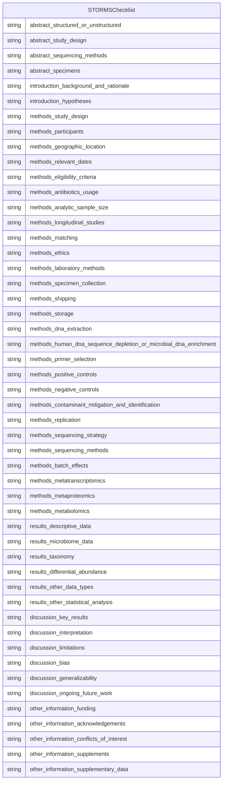

# Storms Evaluation Template

A template for extracting information using STORMS checklist

URI: https://w3id.org/ontogpt/storms

Name: storms-template

## Schema Diagram

## Classes

| Class | Description |
| --- | --- |
| [AnnotatorResult](AnnotatorResult.md) | None |
| [Any](Any.md) | None |
| [CompoundExpression](CompoundExpression.md) | None |
| &nbsp;&nbsp;&nbsp;&nbsp;&nbsp;&nbsp;&nbsp;&nbsp;[Triple](Triple.md) | Abstract parent for Relation Extraction tasks |
| [ExtractionResult](ExtractionResult.md) | A result of extracting knowledge on text |
| [NamedEntity](NamedEntity.md) | None |
| &nbsp;&nbsp;&nbsp;&nbsp;&nbsp;&nbsp;&nbsp;&nbsp;[RelationshipType](RelationshipType.md) | None |
| [Publication](Publication.md) | None |
| [STORMSChecklist](STORMSChecklist.md) | A checklist of items that should be reported in a microbiome study. Try and provide a value for ALL items. If an item is not reported, say NOT REPORTED. |
| [TextWithEntity](TextWithEntity.md) | A text containing one or more instances of a single type of entity. |
| [TextWithTriples](TextWithTriples.md) | A text containing one or more relations of the Triple type. |

## Slots

| Slot | Description |
| --- | --- |
| [abstract](abstract.md) | The abstract of the publication |
| [abstract_sequencing_methods](abstract_sequencing_methods.md) | State the strategy used for metagenomic classification |
| [abstract_specimens](abstract_specimens.md) | Describe body site(s) studied |
| [abstract_structured_or_unstructured](abstract_structured_or_unstructured.md) | Abstract should include information on background, methods, results, and conc... |
| [abstract_study_design](abstract_study_design.md) | State study design in abstract |
| [combined_text](combined_text.md) |  |
| [discussion_bias](discussion_bias.md) | Discuss any potential for bias to influence study findings |
| [discussion_generalizability](discussion_generalizability.md) | Discuss the generalizability (external validity) of the study results |
| [discussion_interpretation](discussion_interpretation.md) | Give a cautious overall interpretation of results considering objectives, lim... |
| [discussion_key_results](discussion_key_results.md) | Summarize key results with reference to study objectives |
| [discussion_limitations](discussion_limitations.md) | Discuss limitations of the study, taking into account sources of potential bi... |
| [discussion_ongoing_future_work](discussion_ongoing_future_work.md) | Describe potential future research or ongoing research based on the study's f... |
| [entities](entities.md) |  |
| [extracted_object](extracted_object.md) | The complex objects extracted from the text |
| [full_text](full_text.md) | The full text of the publication |
| [id](id.md) | A unique identifier for the named entity |
| [input_id](input_id.md) |  |
| [input_text](input_text.md) |  |
| [input_title](input_title.md) |  |
| [introduction_background_and_rationale](introduction_background_and_rationale.md) | Summarize the underlying background, scientific evidence, or theory driving t... |
| [introduction_hypotheses](introduction_hypotheses.md) | State the pre-specified hypothesis |
| [label](label.md) | The label (name) of the named thing |
| [methods_analytic_sample_size](methods_analytic_sample_size.md) | Explain how the final analytic sample size was calculated, including the numb... |
| [methods_antibiotics_usage](methods_antibiotics_usage.md) | List what is known about antibiotics usage before or during sample collection |
| [methods_batch_effects](methods_batch_effects.md) | Detail any blocking or randomization used in study design to avoid confoundin... |
| [methods_contaminant_mitigation_and_identification](methods_contaminant_mitigation_and_identification.md) | Provide any laboratory or computational methods used to control for or identi... |
| [methods_dna_extraction](methods_dna_extraction.md) | Provide DNA extraction method, including kit and version if relevant |
| [methods_eligibility_criteria](methods_eligibility_criteria.md) | List any criteria for inclusion and exclusion of recruited participants |
| [methods_ethics](methods_ethics.md) | State the name of the institutional review board that approved the study and ... |
| [methods_geographic_location](methods_geographic_location.md) | State the geographic region(s) where participants were sampled from |
| [methods_human_dna_sequence_depletion_or_microbial_dna_enrichment](methods_human_dna_sequence_depletion_or_microbial_dna_enrichment.md) | Describe whether human DNA sequence depletion or enrichment of microbial or v... |
| [methods_laboratory_methods](methods_laboratory_methods.md) | State the laboratory/center where laboratory work was done |
| [methods_longitudinal_studies](methods_longitudinal_studies.md) | For longitudinal studies, state how many follow-ups were conducted, describe ... |
| [methods_matching](methods_matching.md) | For matched studies, give matching criteria |
| [methods_metabolomics](methods_metabolomics.md) | Specify the analytic method used (such as nuclear magnetic resonance spectros... |
| [methods_metaproteomics](methods_metaproteomics.md) | Detail which protease was used for digestion |
| [methods_metatranscriptomics](methods_metatranscriptomics.md) | Detail whether any mRNA enrichment was performed and whether/how retrotranscr... |
| [methods_negative_controls](methods_negative_controls.md) | Describe any negative controls if used |
| [methods_participants](methods_participants.md) | State what the population of interest is, and the method by which participant... |
| [methods_positive_controls](methods_positive_controls.md) | Describe any positive controls (mock communities) if used |
| [methods_primer_selection](methods_primer_selection.md) | Provide primer selection and DNA amplification methods as well as variable re... |
| [methods_relevant_dates](methods_relevant_dates.md) | State the start and end dates for recruitment, follow-up, and data collection |
| [methods_replication](methods_replication.md) | Describe any biological or technical replicates included in the sequencing, i... |
| [methods_sequencing_methods](methods_sequencing_methods.md) | State whether experimental quantification was used (QMP/cell count based, spi... |
| [methods_sequencing_strategy](methods_sequencing_strategy.md) | Major divisions of strategy, such as shotgun or amplicon sequencing |
| [methods_shipping](methods_shipping.md) | Describe how samples were stored and shipped to the laboratory |
| [methods_specimen_collection](methods_specimen_collection.md) | State the body site(s) sampled from and how specimens were collected |
| [methods_storage](methods_storage.md) | Describe how the laboratory stored samples, including time between collection... |
| [methods_study_design](methods_study_design.md) | Describe the study design |
| [named_entities](named_entities.md) | Named entities extracted from the text |
| [object](object.md) |  |
| [object_id](object_id.md) |  |
| [object_qualifier](object_qualifier.md) | An optional qualifier or modifier for the object of the statement, e |
| [object_text](object_text.md) |  |
| [other_information_acknowledgements](other_information_acknowledgements.md) | Include acknowledgements of those who contributed to the research but did not... |
| [other_information_conflicts_of_interest](other_information_conflicts_of_interest.md) | Include a conflicts of interest statement |
| [other_information_funding](other_information_funding.md) | Give the source of funding and the role of the funders for the present study ... |
| [other_information_supplementary_data](other_information_supplementary_data.md) | Provide supplementary data files of results with all taxa and all outcome var... |
| [other_information_supplements](other_information_supplements.md) | Indicate where supplements may be accessed and what materials they contain |
| [predicate](predicate.md) |  |
| [prompt](prompt.md) |  |
| [publication](publication.md) |  |
| [qualifier](qualifier.md) | A qualifier for the statements, e |
| [raw_completion_output](raw_completion_output.md) |  |
| [results_descriptive_data](results_descriptive_data.md) | Give characteristics of study participants (e |
| [results_differential_abundance](results_differential_abundance.md) | Report results of differential abundance analysis by the variable of interest... |
| [results_microbiome_data](results_microbiome_data.md) | Report descriptive findings for microbiome analyses with all applicable outco... |
| [results_other_data_types](results_other_data_types.md) | Report other data analyzed--e |
| [results_other_statistical_analysis](results_other_statistical_analysis.md) | Report any statistical data analysis not covered above |
| [results_taxonomy](results_taxonomy.md) | Identify taxonomy using standardized taxon classifications that are sufficien... |
| [subject](subject.md) |  |
| [subject_qualifier](subject_qualifier.md) | An optional qualifier or modifier for the subject of the statement, e |
| [subject_text](subject_text.md) |  |
| [title](title.md) | The title of the publication |
| [triples](triples.md) |  |

## Enumerations

| Enumeration | Description |
| --- | --- |
| [NullDataOptions](NullDataOptions.md) |  |

## Types

| Type | Description |
| --- | --- |
| [Boolean](Boolean.md) | A binary (true or false) value |
| [Curie](Curie.md) | a compact URI |
| [Date](Date.md) | a date (year, month and day) in an idealized calendar |
| [DateOrDatetime](DateOrDatetime.md) | Either a date or a datetime |
| [Datetime](Datetime.md) | The combination of a date and time |
| [Decimal](Decimal.md) | A real number with arbitrary precision that conforms to the xsd:decimal speci... |
| [Double](Double.md) | A real number that conforms to the xsd:double specification |
| [Float](Float.md) | A real number that conforms to the xsd:float specification |
| [Integer](Integer.md) | An integer |
| [Jsonpath](Jsonpath.md) | A string encoding a JSON Path |
| [Jsonpointer](Jsonpointer.md) | A string encoding a JSON Pointer |
| [Ncname](Ncname.md) | Prefix part of CURIE |
| [Nodeidentifier](Nodeidentifier.md) | A URI, CURIE or BNODE that represents a node in a model |
| [Objectidentifier](Objectidentifier.md) | A URI or CURIE that represents an object in the model |
| [Sparqlpath](Sparqlpath.md) | A string encoding a SPARQL Property Path |
| [String](String.md) | A character string |
| [Time](Time.md) | A time object represents a (local) time of day, independent of any particular... |
| [Uri](Uri.md) | a complete URI |
| [Uriorcurie](Uriorcurie.md) | a URI or a CURIE |

## Subsets

| Subset | Description |
| --- | --- |
