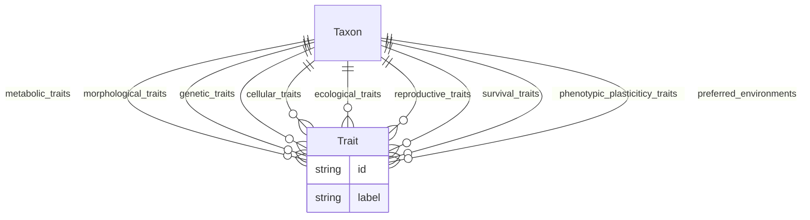

# Class: Taxon


URI: [traits:Taxon](http://w3id.org/ontogpt/traits/Taxon)





<!-- no inheritance hierarchy -->


## Slots

| Name | Cardinality and Range | Description | Inheritance |
| ---  | --- | --- | --- |
| [metabolic_traits](metabolic_traits.md) | * <br/> [Trait](Trait.md) | The metabolic traits for the taxon | direct |
| [morphological_traits](morphological_traits.md) | * <br/> [Trait](Trait.md) | The morphological traits for the taxon | direct |
| [genetic_traits](genetic_traits.md) | * <br/> [Trait](Trait.md) | The genetic traits for the taxon | direct |
| [cellular_traits](cellular_traits.md) | * <br/> [Trait](Trait.md) | The cellular traits for the taxon | direct |
| [ecological_traits](ecological_traits.md) | * <br/> [Trait](Trait.md) | The ecological traits for the taxon | direct |
| [reproductive_traits](reproductive_traits.md) | * <br/> [Trait](Trait.md) | The reproductive traits for the taxon | direct |
| [survival_traits](survival_traits.md) | * <br/> [Trait](Trait.md) | The survival traits for the taxon | direct |
| [phenotypic_plasticiticy_traits](phenotypic_plasticiticy_traits.md) | * <br/> [Trait](Trait.md) | The phenotypic plasticiticy traits for the taxon | direct |
| [preferred_environments](preferred_environments.md) | * <br/> [Trait](Trait.md) | The preferred environments for the taxon | direct |


## Identifier and Mapping Information


### Schema Source


* from schema: http://w3id.org/ontogpt/traits


## Mappings

| Mapping Type | Mapped Value |
| ---  | ---  |
| self | traits:Taxon |
| native | traits:Taxon |


## LinkML Source

<!-- TODO: investigate https://stackoverflow.com/questions/37606292/how-to-create-tabbed-code-blocks-in-mkdocs-or-sphinx -->

### Direct

<details>
```yaml
name: Taxon
from_schema: http://w3id.org/ontogpt/traits
attributes:
  metabolic_traits:
    name: metabolic_traits
    annotations:
      prompt:
        tag: prompt
        value: a semicolon separated list of every specific organism metabolic trait
    description: The metabolic traits for the taxon.
    from_schema: http://w3id.org/ontogpt/traits
    rank: 1000
    multivalued: true
    domain_of:
    - Taxon
    range: Trait
  morphological_traits:
    name: morphological_traits
    annotations:
      prompt:
        tag: prompt
        value: a semicolon separated list of every specific organism morphological
          trait
    description: The morphological traits for the taxon.
    from_schema: http://w3id.org/ontogpt/traits
    rank: 1000
    multivalued: true
    domain_of:
    - Taxon
    range: Trait
  genetic_traits:
    name: genetic_traits
    annotations:
      prompt:
        tag: prompt
        value: a semicolon separated list of every specific organism genetic trait
    description: The genetic traits for the taxon.
    from_schema: http://w3id.org/ontogpt/traits
    rank: 1000
    multivalued: true
    domain_of:
    - Taxon
    range: Trait
  cellular_traits:
    name: cellular_traits
    annotations:
      prompt:
        tag: prompt
        value: a semicolon separated list of every specific organism cellular trait
    description: The cellular traits for the taxon.
    from_schema: http://w3id.org/ontogpt/traits
    rank: 1000
    multivalued: true
    domain_of:
    - Taxon
    range: Trait
  ecological_traits:
    name: ecological_traits
    annotations:
      prompt:
        tag: prompt
        value: a semicolon separated list of every specific organism ecological trait
    description: The ecological traits for the taxon.
    from_schema: http://w3id.org/ontogpt/traits
    rank: 1000
    multivalued: true
    domain_of:
    - Taxon
    range: Trait
  reproductive_traits:
    name: reproductive_traits
    annotations:
      prompt:
        tag: prompt
        value: a semicolon separated list of every specific organism reproductive
          trait
    description: The reproductive traits for the taxon.
    from_schema: http://w3id.org/ontogpt/traits
    rank: 1000
    multivalued: true
    domain_of:
    - Taxon
    range: Trait
  survival_traits:
    name: survival_traits
    annotations:
      prompt:
        tag: prompt
        value: a semicolon separated list of every specific organism survival trait
    description: The survival traits for the taxon.
    from_schema: http://w3id.org/ontogpt/traits
    rank: 1000
    multivalued: true
    domain_of:
    - Taxon
    range: Trait
  phenotypic_plasticiticy_traits:
    name: phenotypic_plasticiticy_traits
    annotations:
      prompt:
        tag: prompt
        value: a semicolon separated list of every specific organism phenotypic plasticiticy
          trait
    description: The phenotypic plasticiticy traits for the taxon.
    from_schema: http://w3id.org/ontogpt/traits
    rank: 1000
    multivalued: true
    domain_of:
    - Taxon
    range: Trait
  preferred_environments:
    name: preferred_environments
    annotations:
      prompt:
        tag: prompt
        value: a semicolon separated list of the environments the organism is typically
          found in or isolated from
    description: The preferred environments for the taxon.
    from_schema: http://w3id.org/ontogpt/traits
    rank: 1000
    multivalued: true
    domain_of:
    - Taxon
    range: Trait
tree_root: true

```
</details>

### Induced

<details>
```yaml
name: Taxon
from_schema: http://w3id.org/ontogpt/traits
attributes:
  metabolic_traits:
    name: metabolic_traits
    annotations:
      prompt:
        tag: prompt
        value: a semicolon separated list of every specific organism metabolic trait
    description: The metabolic traits for the taxon.
    from_schema: http://w3id.org/ontogpt/traits
    rank: 1000
    multivalued: true
    alias: metabolic_traits
    owner: Taxon
    domain_of:
    - Taxon
    range: Trait
  morphological_traits:
    name: morphological_traits
    annotations:
      prompt:
        tag: prompt
        value: a semicolon separated list of every specific organism morphological
          trait
    description: The morphological traits for the taxon.
    from_schema: http://w3id.org/ontogpt/traits
    rank: 1000
    multivalued: true
    alias: morphological_traits
    owner: Taxon
    domain_of:
    - Taxon
    range: Trait
  genetic_traits:
    name: genetic_traits
    annotations:
      prompt:
        tag: prompt
        value: a semicolon separated list of every specific organism genetic trait
    description: The genetic traits for the taxon.
    from_schema: http://w3id.org/ontogpt/traits
    rank: 1000
    multivalued: true
    alias: genetic_traits
    owner: Taxon
    domain_of:
    - Taxon
    range: Trait
  cellular_traits:
    name: cellular_traits
    annotations:
      prompt:
        tag: prompt
        value: a semicolon separated list of every specific organism cellular trait
    description: The cellular traits for the taxon.
    from_schema: http://w3id.org/ontogpt/traits
    rank: 1000
    multivalued: true
    alias: cellular_traits
    owner: Taxon
    domain_of:
    - Taxon
    range: Trait
  ecological_traits:
    name: ecological_traits
    annotations:
      prompt:
        tag: prompt
        value: a semicolon separated list of every specific organism ecological trait
    description: The ecological traits for the taxon.
    from_schema: http://w3id.org/ontogpt/traits
    rank: 1000
    multivalued: true
    alias: ecological_traits
    owner: Taxon
    domain_of:
    - Taxon
    range: Trait
  reproductive_traits:
    name: reproductive_traits
    annotations:
      prompt:
        tag: prompt
        value: a semicolon separated list of every specific organism reproductive
          trait
    description: The reproductive traits for the taxon.
    from_schema: http://w3id.org/ontogpt/traits
    rank: 1000
    multivalued: true
    alias: reproductive_traits
    owner: Taxon
    domain_of:
    - Taxon
    range: Trait
  survival_traits:
    name: survival_traits
    annotations:
      prompt:
        tag: prompt
        value: a semicolon separated list of every specific organism survival trait
    description: The survival traits for the taxon.
    from_schema: http://w3id.org/ontogpt/traits
    rank: 1000
    multivalued: true
    alias: survival_traits
    owner: Taxon
    domain_of:
    - Taxon
    range: Trait
  phenotypic_plasticiticy_traits:
    name: phenotypic_plasticiticy_traits
    annotations:
      prompt:
        tag: prompt
        value: a semicolon separated list of every specific organism phenotypic plasticiticy
          trait
    description: The phenotypic plasticiticy traits for the taxon.
    from_schema: http://w3id.org/ontogpt/traits
    rank: 1000
    multivalued: true
    alias: phenotypic_plasticiticy_traits
    owner: Taxon
    domain_of:
    - Taxon
    range: Trait
  preferred_environments:
    name: preferred_environments
    annotations:
      prompt:
        tag: prompt
        value: a semicolon separated list of the environments the organism is typically
          found in or isolated from
    description: The preferred environments for the taxon.
    from_schema: http://w3id.org/ontogpt/traits
    rank: 1000
    multivalued: true
    alias: preferred_environments
    owner: Taxon
    domain_of:
    - Taxon
    range: Trait
tree_root: true

```
</details>