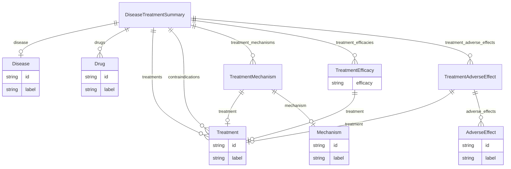

# Class: DiseaseTreatmentSummary


URI: [treatment:DiseaseTreatmentSummary](http://w3id.org/ontogpt/treatments/DiseaseTreatmentSummary)





<!-- no inheritance hierarchy -->


## Slots

| Name | Cardinality and Range | Description | Inheritance |
| ---  | --- | --- | --- |
| [disease](disease.md) | 0..1 <br/> [Disease](Disease.md) | the name of the disease that is treated | direct |
| [drugs](drugs.md) | 0..* <br/> [Drug](Drug.md) | semicolon-separated list of named small molecule drugs | direct |
| [treatments](treatments.md) | 0..* <br/> [Treatment](Treatment.md) | semicolon-separated list of therapies and treatments are indicated for treati... | direct |
| [contraindications](contraindications.md) | 0..* <br/> [Treatment](Treatment.md) | semicolon-separated list of therapies and treatments that are contra-indicate... | direct |
| [treatment_mechanisms](treatment_mechanisms.md) | 0..* <br/> [TreatmentMechanism](TreatmentMechanism.md) | semicolon-separated list of treatment to asterisk-separated mechanism associa... | direct |
| [treatment_efficacies](treatment_efficacies.md) | 0..* <br/> [TreatmentEfficacy](TreatmentEfficacy.md) | semicolon-separated list of treatment to efficacy associations, e | direct |
| [treatment_adverse_effects](treatment_adverse_effects.md) | 0..* <br/> [TreatmentAdverseEffect](TreatmentAdverseEffect.md) | semicolon-separated list of treatment to adverse effect associations, e | direct |


## Identifier and Mapping Information


### Schema Source


* from schema: http://w3id.org/ontogpt/treatment


## Mappings

| Mapping Type | Mapped Value |
| ---  | ---  |
| self | treatment:DiseaseTreatmentSummary |
| native | treatment:DiseaseTreatmentSummary |


## LinkML Source

<!-- TODO: investigate https://stackoverflow.com/questions/37606292/how-to-create-tabbed-code-blocks-in-mkdocs-or-sphinx -->

### Direct

<details>
```yaml
name: DiseaseTreatmentSummary
from_schema: http://w3id.org/ontogpt/treatment
rank: 1000
attributes:
  disease:
    name: disease
    description: the name of the disease that is treated.
    from_schema: http://w3id.org/ontogpt/treatment
    rank: 1000
    range: Disease
  drugs:
    name: drugs
    description: semicolon-separated list of named small molecule drugs
    from_schema: http://w3id.org/ontogpt/treatment
    rank: 1000
    multivalued: true
    range: Drug
  treatments:
    name: treatments
    annotations:
      prompt.examples:
        tag: prompt.examples
        value: Imatinib, exercise, surgery
    description: semicolon-separated list of therapies and treatments are indicated
      for treating the disease.
    from_schema: http://w3id.org/ontogpt/treatment
    rank: 1000
    multivalued: true
    range: Treatment
  contraindications:
    name: contraindications
    annotations:
      prompt.examples:
        tag: prompt.examples
        value: Beta-blockers, exercise, surgery
    description: semicolon-separated list of therapies and treatments that are contra-indicated
      for the disease, and should not be used, due to risk of adverse effects.
    from_schema: http://w3id.org/ontogpt/treatment
    rank: 1000
    multivalued: true
    range: Treatment
  treatment_mechanisms:
    name: treatment_mechanisms
    annotations:
      prompt.separator:
        tag: prompt.separator
        value: '*'
    description: semicolon-separated list of treatment to asterisk-separated mechanism
      associations
    from_schema: http://w3id.org/ontogpt/treatment
    rank: 1000
    multivalued: true
    range: TreatmentMechanism
  treatment_efficacies:
    name: treatment_efficacies
    annotations:
      prompt.separator:
        tag: prompt.separator
        value: '*'
    description: semicolon-separated list of treatment to efficacy associations, e.g.
      Imatinib*effective
    from_schema: http://w3id.org/ontogpt/treatment
    rank: 1000
    multivalued: true
    range: TreatmentEfficacy
  treatment_adverse_effects:
    name: treatment_adverse_effects
    annotations:
      prompt.separator:
        tag: prompt.separator
        value: '*'
    description: semicolon-separated list of treatment to adverse effect associations,
      e.g. Imatinib*nausea
    from_schema: http://w3id.org/ontogpt/treatment
    rank: 1000
    multivalued: true
    range: TreatmentAdverseEffect
tree_root: true

```
</details>

### Induced

<details>
```yaml
name: DiseaseTreatmentSummary
from_schema: http://w3id.org/ontogpt/treatment
rank: 1000
attributes:
  disease:
    name: disease
    description: the name of the disease that is treated.
    from_schema: http://w3id.org/ontogpt/treatment
    rank: 1000
    alias: disease
    owner: DiseaseTreatmentSummary
    domain_of:
    - DiseaseTreatmentSummary
    range: Disease
  drugs:
    name: drugs
    description: semicolon-separated list of named small molecule drugs
    from_schema: http://w3id.org/ontogpt/treatment
    rank: 1000
    multivalued: true
    alias: drugs
    owner: DiseaseTreatmentSummary
    domain_of:
    - DiseaseTreatmentSummary
    range: Drug
  treatments:
    name: treatments
    annotations:
      prompt.examples:
        tag: prompt.examples
        value: Imatinib, exercise, surgery
    description: semicolon-separated list of therapies and treatments are indicated
      for treating the disease.
    from_schema: http://w3id.org/ontogpt/treatment
    rank: 1000
    multivalued: true
    alias: treatments
    owner: DiseaseTreatmentSummary
    domain_of:
    - DiseaseTreatmentSummary
    range: Treatment
  contraindications:
    name: contraindications
    annotations:
      prompt.examples:
        tag: prompt.examples
        value: Beta-blockers, exercise, surgery
    description: semicolon-separated list of therapies and treatments that are contra-indicated
      for the disease, and should not be used, due to risk of adverse effects.
    from_schema: http://w3id.org/ontogpt/treatment
    rank: 1000
    multivalued: true
    alias: contraindications
    owner: DiseaseTreatmentSummary
    domain_of:
    - DiseaseTreatmentSummary
    range: Treatment
  treatment_mechanisms:
    name: treatment_mechanisms
    annotations:
      prompt.separator:
        tag: prompt.separator
        value: '*'
    description: semicolon-separated list of treatment to asterisk-separated mechanism
      associations
    from_schema: http://w3id.org/ontogpt/treatment
    rank: 1000
    multivalued: true
    alias: treatment_mechanisms
    owner: DiseaseTreatmentSummary
    domain_of:
    - DiseaseTreatmentSummary
    range: TreatmentMechanism
  treatment_efficacies:
    name: treatment_efficacies
    annotations:
      prompt.separator:
        tag: prompt.separator
        value: '*'
    description: semicolon-separated list of treatment to efficacy associations, e.g.
      Imatinib*effective
    from_schema: http://w3id.org/ontogpt/treatment
    rank: 1000
    multivalued: true
    alias: treatment_efficacies
    owner: DiseaseTreatmentSummary
    domain_of:
    - DiseaseTreatmentSummary
    range: TreatmentEfficacy
  treatment_adverse_effects:
    name: treatment_adverse_effects
    annotations:
      prompt.separator:
        tag: prompt.separator
        value: '*'
    description: semicolon-separated list of treatment to adverse effect associations,
      e.g. Imatinib*nausea
    from_schema: http://w3id.org/ontogpt/treatment
    rank: 1000
    multivalued: true
    alias: treatment_adverse_effects
    owner: DiseaseTreatmentSummary
    domain_of:
    - DiseaseTreatmentSummary
    range: TreatmentAdverseEffect
tree_root: true

```
</details>