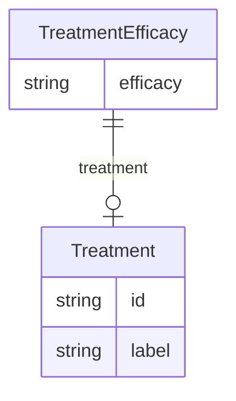

# Class: TreatmentEfficacy


URI: [treatment:TreatmentEfficacy](http://w3id.org/ontogpt/treatments/TreatmentEfficacy)





## Inheritance
* [CompoundExpression](CompoundExpression.md)
    * **TreatmentEfficacy**


## Slots

| Name | Cardinality and Range | Description | Inheritance |
| ---  | --- | --- | --- |
| [treatment](treatment.md) | 0..1 <br/> NONE |  | direct |
| [efficacy](efficacy.md) | 0..1 <br/> [xsd:string](xsd:string) |  | direct |


## Usages

| used by | used in | type | used |
| ---  | --- | --- | --- |
| [DiseaseTreatmentSummary](DiseaseTreatmentSummary.md) | [treatment_efficacies](treatment_efficacies.md) | range | [TreatmentEfficacy](TreatmentEfficacy.md) |


## Identifier and Mapping Information


### Schema Source


* from schema: http://w3id.org/ontogpt/treatment


## Mappings

| Mapping Type | Mapped Value |
| ---  | ---  |
| self | treatment:TreatmentEfficacy |
| native | treatment:TreatmentEfficacy |


## LinkML Source

<!-- TODO: investigate https://stackoverflow.com/questions/37606292/how-to-create-tabbed-code-blocks-in-mkdocs-or-sphinx -->

### Direct

<details>
```yaml
name: TreatmentEfficacy
from_schema: http://w3id.org/ontogpt/treatment
rank: 1000
is_a: CompoundExpression
attributes:
  treatment:
    name: treatment
    from_schema: http://w3id.org/ontogpt/treatment
    range: Treatment
  efficacy:
    name: efficacy
    from_schema: http://w3id.org/ontogpt/treatment
    rank: 1000
    range: string

```
</details>

### Induced

<details>
```yaml
name: TreatmentEfficacy
from_schema: http://w3id.org/ontogpt/treatment
rank: 1000
is_a: CompoundExpression
attributes:
  treatment:
    name: treatment
    from_schema: http://w3id.org/ontogpt/treatment
    alias: treatment
    owner: TreatmentEfficacy
    domain_of:
    - TreatmentMechanism
    - TreatmentEfficacy
    range: Treatment
  efficacy:
    name: efficacy
    from_schema: http://w3id.org/ontogpt/treatment
    rank: 1000
    alias: efficacy
    owner: TreatmentEfficacy
    domain_of:
    - TreatmentEfficacy
    range: string

```
</details>