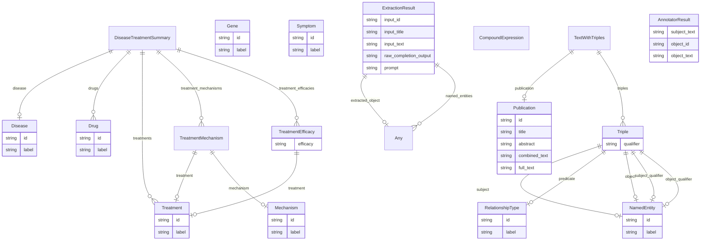

# MAXO treatment Template

A template for MAXO treatments

URI: http://w3id.org/ontogpt/treatment
Name: treatment-template

## Schema Diagram

## Classes

| Class | Description |
| --- | --- |
| [AnnotatorResult](AnnotatorResult.md) |  |
| [Any](Any.md) |  |
| [CompoundExpression](CompoundExpression.md) |  |
| [Disease](Disease.md) |  |
| [DiseaseTreatmentSummary](DiseaseTreatmentSummary.md) |  |
| [Drug](Drug.md) |  |
| [ExtractionResult](ExtractionResult.md) | A result of extracting knowledge on text |
| [Gene](Gene.md) |  |
| [Mechanism](Mechanism.md) |  |
| [NamedEntity](NamedEntity.md) |  |
| [Publication](Publication.md) |  |
| [RelationshipType](RelationshipType.md) |  |
| [Symptom](Symptom.md) |  |
| [TextWithTriples](TextWithTriples.md) |  |
| [Treatment](Treatment.md) |  |
| [TreatmentEfficacy](TreatmentEfficacy.md) |  |
| [TreatmentMechanism](TreatmentMechanism.md) |  |
| [Triple](Triple.md) | Abstract parent for Relation Extraction tasks |

## Slots

| Slot | Description |
| --- | --- |
| [abstract](abstract.md) | The abstract of the publication |
| [combined_text](combined_text.md) |  |
| [disease](disease.md) | the name of the disease that is treated |
| [drugs](drugs.md) | semicolon-separated list of named small molecule drugs |
| [efficacy](efficacy.md) |  |
| [extracted_object](extracted_object.md) | The complex objects extracted from the text |
| [full_text](full_text.md) | The full text of the publication |
| [id](id.md) | A unique identifier for the named entity |
| [input_id](input_id.md) |  |
| [input_text](input_text.md) |  |
| [input_title](input_title.md) |  |
| [label](label.md) | The label (name) of the named thing |
| [mechanism](mechanism.md) |  |
| [named_entities](named_entities.md) | Named entities extracted from the text |
| [object](object.md) |  |
| [object_id](object_id.md) |  |
| [object_qualifier](object_qualifier.md) | An optional qualifier or modifier for the object of the statement, e |
| [object_text](object_text.md) |  |
| [predicate](predicate.md) |  |
| [prompt](prompt.md) |  |
| [publication](publication.md) |  |
| [qualifier](qualifier.md) | A qualifier for the statements, e |
| [raw_completion_output](raw_completion_output.md) |  |
| [subject](subject.md) |  |
| [subject_qualifier](subject_qualifier.md) | An optional qualifier or modifier for the subject of the statement, e |
| [subject_text](subject_text.md) |  |
| [title](title.md) | The title of the publication |
| [treatment](treatment.md) |  |
| [treatment_efficacies](treatment_efficacies.md) | semicolon-separated list of treatment to efficacy associations, e |
| [treatment_mechanisms](treatment_mechanisms.md) | semicolon-separated list of treatment to asterisk-separated mechanism associa... |
| [treatments](treatments.md) | semicolon-separated list of therapies and treatments |
| [triples](triples.md) |  |

## Enumerations

| Enumeration | Description |
| --- | --- |

## Types

| Type | Description |
| --- | --- |
| [xsd:boolean](xsd:boolean) | A binary (true or false) value |
| [xsd:date](xsd:date) | a date (year, month and day) in an idealized calendar |
| [linkml:DateOrDatetime](https://w3id.org/linkml/DateOrDatetime) | Either a date or a datetime |
| [xsd:dateTime](xsd:dateTime) | The combination of a date and time |
| [xsd:decimal](xsd:decimal) | A real number with arbitrary precision that conforms to the xsd:decimal speci... |
| [xsd:double](xsd:double) | A real number that conforms to the xsd:double specification |
| [xsd:float](xsd:float) | A real number that conforms to the xsd:float specification |
| [xsd:integer](xsd:integer) | An integer |
| [xsd:string](xsd:string) | Prefix part of CURIE |
| [shex:nonLiteral](shex:nonLiteral) | A URI, CURIE or BNODE that represents a node in a model |
| [shex:iri](shex:iri) | A URI or CURIE that represents an object in the model |
| [xsd:string](xsd:string) | A character string |
| [xsd:dateTime](xsd:dateTime) | A time object represents a (local) time of day, independent of any particular... |
| [xsd:anyURI](xsd:anyURI) | a complete URI |
| [xsd:anyURI](xsd:anyURI) | a URI or a CURIE |

## Subsets

| Subset | Description |
| --- | --- |
